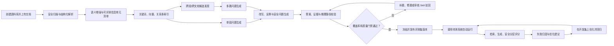

# 智能评测集平台业务需求书

> 文档范围：后端业务与数据流程，不包含前端页面设计  
> 文档版本：V1.2（新增智能问答交互 + 业务需求书→测试功能点）  
> 编写日期：2026-07-22  
> 项目目录：`micro_innovation`  
> 建议产品代号：EvalForge（评测集锻造平台）

## 1. 文档摘要

本平台面向授信政策、企业财报等专业文档场景，将用户上传的一组文档转化为一套可验证、可回溯、可复现的问答评测集，并自动运行评测、定位失败原因和给出优化建议。

平台的核心不是“让大模型按段落多出题”，而是建立以下闭环：

1. 保存不可篡改的原始文档和版面定位信息；
2. 抽取目录、段落、表格、术语、指标、规则、例外和可评测信息单元；
3. 同时建立关键词、向量和语义关系索引；
4. 按单段、跨段、跨文档、改写、安全边界等类型生成问题及标准答案；
5. 用“可评测信息单元覆盖率”而不是“问题数量”计算覆盖率；
6. 对每个答案保存可回溯的原文证据和推理路径；
7. 自动执行目标问答系统，分别评估检索和答案生成；
8. 将失败案例归因后，优化文档解析、语义表示、检索策略或评测题本身，再进行回归测试。

发布一版评测集时，默认要求：

- 加权可评测信息单元覆盖率 **> 85%**；
- 高风险、强制合规信息单元覆盖率 **= 100%**；
- 标准答案证据回溯率 **= 100%**；
- 所有样本必须通过评测治理审核 Skill 的强制规则检查；
- 无法由上传材料支持的问题不得伪造答案，应被删除或标记为“不可回答题”；
- 同义改写只增加表达鲁棒性，不重复计入信息单元覆盖率。

## 2. 背景与业务问题

### 2.1 业务背景

新的授信政策、制度文件或企业财报发布后，需要快速构造高质量问答评测集，以验证大模型、RAG 系统或其他问答方法是否能够：

- 找到正确的原文证据；
- 区分相近但不同的专业概念；
- 综合同一文档的多个段落；
- 综合多个文档中的分散信息；
- 给出有依据、无幻觉、符合安全合规要求的答案；
- 在材料没有答案时正确拒答。

### 2.2 当前痛点

1. **普通切块破坏上下文。** 固定长度切块容易切断标题、规则、限定条件、表格和例外条款。
2. **只做向量检索难以消歧。** “利润率”“净利润率”“营业利润率”等词面高度相似，但口径、公式、期间和主体可能不同。
3. **只做摘要会丢失细节。** 摘要适合导航和主题理解，不能替代原文、数字、公式、限定语和例外条款。
4. **跨段关系不能只由相似度决定。** 真正的跨段问题还可能来自“规则—例外”“定义—计算公式”“旧政策—新政策”“同一指标—不同期间”等关系。
5. **覆盖率缺少可计算口径。** 按段落是否出题或按题目数量计算，容易被大量重复、简单题“刷高”。
6. **自动生成的问题可能有歧义或幻觉。** 问题可能无法仅凭原文回答，标准答案也可能超出证据。
7. **只看最终答案准确率无法定位问题。** 必须区分是解析、检索、重排、上下文组织、生成模型还是评测题本身导致失败。
8. **直接用测试集调参会产生数据泄漏。** 优化用例与最终验收用例必须隔离并版本化。

## 3. 产品定位

### 3.1 产品定义

EvalForge 是一个“文档知识编译 + 评测集生成 + 自动评估诊断 + 智能问答交互”平台。它不绑定某一种 RAG 框架或大模型，而是产出标准化、可导出的评测数据，并通过适配器调用待测系统。

平台提供智能问答交互界面，用户可通过自然语言对话完成文档上传、评测集查看与编辑、知识问答等全部平台功能调用。评测集生成支持两种模式：从文档生成问答对评测集，以及从业务需求书提取测试功能点（EIU）。

### 3.2 业务目标

| 编号 | 目标 | 衡量方式 |
|---|---|---|
| BG-01 | 从多文档自动生成可靠评测集 | 通过质量门禁的题目数及通过率 |
| BG-02 | 证明覆盖率而非主观声称覆盖率 | 加权可评测信息单元覆盖率 > 85% |
| BG-03 | 所有正确答案均可回溯 | 证据回溯率 100%，包含文档、页码/章节、原文范围 |
| BG-04 | 覆盖专业术语消歧和跨材料推理 | 术语消歧题、跨段题、跨文档题达到配置占比 |
| BG-05 | 自动发现问答系统薄弱点 | 每个失败用例有一级归因和优化建议 |
| BG-06 | 支持多轮迭代且结果可复现 | 文档、解析、索引、提示词、模型、评测集和运行记录均有版本 |
| BG-07 | 智能问答交互完成平台功能调用 | 对话中可完成文档上传、预览、编辑和知识问答 |
| BG-08 | 支持业务需求书生成测试功能点 | 从业务需求书提取 EIU 清单，无需生成标准答案 |

### 3.3 基础功能完成后的优化方向

以下内容作为核心闭环稳定后的增强方向，不影响第一阶段完成文档处理、问题生成、自动审核和评测诊断：

- 增加评测结果可视化、检索链路回放和交互式调试界面；
- 增强扫描件、复杂表格、图片、图表等多模态资料的理解能力；
- 引入更完整的知识图谱、社区摘要和复杂多跳推理；
- 支持更多 Embedding、Reranker、生成模型和审核模型的自动对比；
- 评估是否需要针对特定领域训练或微调模型；
- 面向更大数据规模扩展为分布式存储、计算和索引架构；
- 在单用户闭环验证稳定后，再评估多用户协作、权限分级和审批流程；
- 基于 Error Book 自动搜索更优的切块、召回、重排和提示词配置。

## 4. 使用对象与平台职责

### 4.1 使用对象

本平台第一阶段只设一个业务使用者，不再拆分数据集创建者、审核专家、评测工程师和管理员等角色。用户负责：

- 上传需要生成评测集的一组文档；
- 填写评测场景、覆盖目标和必要业务说明；
- 发起文档处理、问题生成和自动评测任务；
- 查看覆盖缺口、审核 Skill 的阻断原因和评测诊断结果；
- 对最终版本执行确认、发布和导出。

用户不需要自行搭建数据库、配置向量索引或逐题组织专家审核。

### 4.2 平台预配置职责

平台交付前必须准备好以下后台能力，并通过统一配置文件或配置中心进行版本管理：

| 后台能力 | 预配置要求 |
|---|---|
| 原始文档存储 | 保存原文件、内容哈希、版本、页码和版面定位信息 |
| 结构化数据库 | 保存语料库、文档、文段、术语、关系、评测题、运行结果和审计记录 |
| 向量存储/索引 | 保存文段、上下文说明和语义摘要的向量及其业务主键映射 |
| 语义理解存储 | 保存可评测信息单元、指标口径、实体关系、冲突和置信度 |
| Embedding 模型 | 预设模型名称、版本、向量维度、最大长度、归一化方式、批大小和运行设备 |
| Reranker 模型 | 预设模型名称、版本、输入长度、候选数量、返回数量和超时策略 |
| 生成模型 | 预设问题生成、答案生成和问题改写的模型、提示词及参数 |
| 评测治理审核 Skill | 预置领域审核、安全合规、隐私脱敏、证据核验和发布阻断规则 |
| 待测系统适配器 | 预置标准输入输出协议，支持记录检索结果、上下文和最终答案 |

模型或规则发生变化时，必须形成新配置版本；历史评测集和运行结果继续引用原配置，不得被静默覆盖。

## 5. 核心业务原则

### 5.1 摘要是导航层，不是证据层

每个文段可以同时保存原文、上下文说明、摘要、向量、术语和关系，但生成标准答案和进行事实核验时，必须回到原始证据。摘要不得成为唯一证据。

### 5.2 数据处理与语义理解同步进行

解析文档时不能只生成无语义的切块。每个文段应同步补充：

- 所属目录路径和父子结构；
- 文档类型、主题、主体、期间、币种、单位；
- 术语及规范名称；
- 指标口径、公式和限定条件；
- 规则、条件、例外、禁止事项、时效；
- 与其他文段的关系；
- 可评测信息单元；
- 原文定位和解析质量。

### 5.3 原文、知识表示与检索索引分层

平台至少保留以下五层，不允许相互替代：

1. **原始证据层**：原始文件、文件哈希、页码和版面坐标，是最终事实源；
2. **结构化解析层**：标题、段落、句子、列表、表格、脚注及父子结构；
3. **语义知识层**：摘要、可评测信息单元、术语、实体、指标、关系和冲突；
4. **检索索引层**：关键词/稀疏索引、向量索引和关系图索引；
5. **评测反馈层**：问题、答案、证据、失败案例、优化记录和回归结果。

### 5.4 覆盖率按可评测信息单元计算

一个自然段不是固定等于一个信息单元。平台需要先把原文拆成可独立验证的事实、规则、条件、例外、数值、日期、公式或流程步骤，再计算其中多少项已经有合格问题覆盖。对同一信息单元生成十种问法仍只计算一次覆盖；段落拆分方法和示例见 8.3 与 8.5。

### 5.5 检索正确与答案正确分开评估

正确证据没有进入上下文属于检索问题；正确证据已经进入上下文但答案仍错误，属于生成、推理或上下文组织问题。两者不能混为一个“准确率”。

### 5.6 原文没有答案时允许“正确找不到”

如果上传材料本身不包含答案，平台不能为了提高准确率而编造内容。该情况应：

- 将题目修订或删除；或
- 有意保留为不可回答题，并把“基于材料明确拒答”设为正确答案。

## 6. 端到端业务流程



## 7. 功能范围总览

| 模块 | 核心能力 | 实施层级 |
|---|---|---|
| 语料库与版本 | 多文件上传、文件分组、哈希、版本冻结 | 核心 |
| 文档解析 | 目录、段落、表格、页码、坐标、OCR 质量 | 核心 |
| 语义理解 | 摘要、术语、实体、指标、可评测信息单元、关系 | 核心 |
| 多路索引 | 关键词、向量、元数据过滤、父子结构 | 核心 |
| 单段问答生成 | 问题、答案、证据、质量校验 | 核心 |
| 跨段/跨文档生成 | 候选发现、关系确认、多跳问题 | 核心 |
| 改写与反例 | 多表达变体、易混概念、不可回答题 | 核心 |
| 覆盖率与审核 | 覆盖计算、缺口清单、审核 Skill、发布阻断 | 核心 |
| 自动评测 | 待测系统适配、批量运行、分层指标 | 核心 |
| 失败诊断 | 自动归因、修复建议、回归比较 | 核心 |
| 评测集事后编辑 | 手动修题、删除/停用、编辑批次与版本 | 核心 |
| 目录架构浏览与导出 | 按原文档章节浏览、扁平/目录结构导出 | 核心 |
| 增量更新与问题生成 | 增量 EIU 回写、仅变化 EIU 补题、复用 | 核心 |
| 表述替换泛化 | 已发布集受控替换与旧变体淘汰 | 核心 |
| 评测集回流 | 人工标注、回流工作台、筛选分流与处理闭环 | 核心 |
| 空评测集处理 | 无实质内容语料库判定、空集发布与门禁衔接 | 核心 |
| 智能问答交互 | 对话式平台操作、文档上传/预览/编辑、知识问答 | 核心（Demo 延后） |
| 业务需求书→测试功能点 | 接收业务需求书，提取 EIU 测试功能点（不含标准答案） | 核心 |


## 8. 详细业务需求

### 8.1 语料库与文档接入

#### FR-CORPUS-001 创建评测语料库

用户应能创建一个隔离的语料库（Corpus），同一次上传或后续补充的多个文件可归属于同一语料库。跨文档比对只能在同一语料库和相同权限范围内进行。

最低字段：

- `corpus_id`、名称、业务领域、创建人；
- 资料密级、允许使用的模型范围；
- 默认语言、时区；
- 生效日期/评测基准日期；
- 文档范围和排除规则；
- 语料库版本。

#### FR-CORPUS-002 文件接入

MVP 支持 PDF、DOCX、TXT、Markdown、CSV、XLSX；扫描 PDF 应支持 OCR 或明确标记为解析失败。每个文件保存：

- 文件名、类型、大小和内容哈希；
- 上传人、上传时间、来源说明；
- 文档版本、生效日期、失效日期；
- 权威等级；
- 解析状态和错误原因；
- 原始文件存储地址。

系统应以文件哈希进行重复检测。同名但内容不同的文件不得被静默覆盖。

#### FR-CORPUS-003 文档安全预处理

系统应在模型处理前执行：

- 病毒/恶意文件检测；
- 密码保护和损坏文件识别；
- 敏感信息和个人信息识别、分级与可选脱敏；
- 将文档内容视为“不可信数据”，识别并隔离其中的提示注入指令；
- 记录数据是否允许发送到外部模型服务。

### 8.2 结构化解析与可回溯定位

#### FR-PARSE-001 版面感知解析

解析结果不得只有纯文本。系统应尽量识别：

- 文档标题、目录和多级章节；
- 页眉页脚、正文、列表、脚注、批注；
- 表格、单元格、合并单元格、单位和表头；
- 图片及其标题；
- 页码、段落序号和版面坐标；
- 句子在原始文件中的起止位置。

#### FR-PARSE-002 层级文段

系统应生成父子层级，而不是只有固定长度切块：

```text
文档
└── 章节
    └── 小节
        └── 语义段落/表格
            └── 句子/表格行/原子证据
```

底层文段用于精确证据定位，上层节点用于补充上下文和全局理解。超长段落可按句子边界切分并保留重叠，但不得切断表格行、公式、规则条件和例外条款。

#### FR-PARSE-003 原文定位

每个可检索文段必须包含：

- `document_id`、`document_version`；
- `section_path`；
- `page_no` 或工作表名称；
- `block_id`、父节点 ID；
- 原文起止偏移或版面坐标；
- 原文文本；
- 解析器版本和解析置信度。

用户或审计人员必须能从任一评测问题回溯到这些字段。

#### FR-PARSE-004 解析质量门禁

系统应检查乱码、空页、目录错位、表格错列、OCR 低置信度、页码缺失等问题。低于配置阈值的文档不得直接进入自动发布流程，应进入异常处理队列并提示用户确认。

### 8.3 语义理解与知识编译

#### FR-SEM-001 文段上下文化

每个底层文段应生成一段简短的“上下文说明”，描述其所属文档、章节、主体、期间和主题。该说明可与原文共同向量化，以降低脱离标题后的语义损失，但不得改写原文。

#### FR-SEM-002 多粒度摘要

系统应按段落、小节、章节和文档生成层级摘要。摘要必须：

- 与对应的子节点保持引用关系；
- 标记生成模型、提示词和版本；
- 不替代底层原文；
- 支持从摘要节点展开到原文节点；
- 在事实核验时被视为“导航信息”，不是最终证据。

此设计兼顾整体阅读和细节保留：高层摘要帮助发现主题，底层原文负责精确回答。

#### FR-SEM-003 可评测信息单元抽取

为使覆盖率可以计算，平台将“知识点”改为更明确的 **可评测信息单元**（Evaluable Information Unit，EIU）。一个 EIU 是一条能够被原文独立证明或否定、并能够形成明确问题与答案的最小业务陈述，例如：

- 一项术语定义；
- 一项适用对象或适用范围；
- 一项带完整条件的规则结论；
- 一个门槛、阈值或数值；
- 一项例外、豁免或禁止事项；
- 一个生效、失效或过渡日期；
- 一个带主体、期间、币种和单位的指标值；
- 一条计算公式或变量口径；
- 一个流程步骤或材料要求；
- 一项文档变更、冲突或继承结论。

EIU 不是按段落字数估算，也不由模型直接回答“这一段有几个知识点”。平台应生成逐条结构化记录，再以记录数量作为分母。每条记录至少包括：

- `eiu_id`；
- 完整陈述；
- 主体、动作/关系、客体或结论；
- 条件、例外、范围、期间、单位等限定信息；
- EIU 类型、内容优先级和权重；
- 原文证据范围；
- 是否可出题及排除原因；
- 抽取模型、审核 Skill 版本和置信度；
- 与重复或关联 EIU 的关系。

#### FR-SEM-004 EIU 拆分与计数规则

平台应遵循以下规则判断一个段落包含多少个 EIU：

1. **独立真值规则**：若两项陈述可以分别被证明为真或假，应拆为两个 EIU。
2. **限定语不可脱离规则**：主体、条件、范围、期间、币种和单位必须与其结论保存在同一 EIU 中，不得为了增加数量而单独计数。
3. **例外单列规则**：一般规则与例外规则分别计数，因为二者可能需要不同问题和证据。
4. **定义与公式分列规则**：定义、公式、变量口径和示例数值能够独立评测时分别计数。
5. **表格业务行规则**：不按单元格机械计数；以“指标 + 主体 + 期间 + 单位 + 数值”的完整记录作为一个 EIU。
6. **无实质内容不计数规则**：标题、目录、过渡句、页眉页脚和重复免责声明默认计为 0。
7. **重复合并规则**：同一事实在多个段落重复出现时建立多个证据引用，但覆盖率分母只保留一个规范 EIU；若文档版本、期间或口径不同，则不得合并。
8. **不可回答排除规则**：证据残缺、OCR 无法确认或只能依赖模型常识补足的内容，不进入默认覆盖率分母，并记录排除原因。

示例原文：

> 小微企业申请流动资金贷款时，资产负债率原则上不得超过 70%；由政策性担保机构提供全额担保的，可放宽至 75%。本规定自 2026 年 8 月 1 日起施行。

该段落拆为 3 个 EIU：

| EIU | 完整陈述 | 类型 |
|---|---|---|
| EIU-1 | 小微企业申请流动资金贷款时，资产负债率原则上不得超过 70% | 一般规则/阈值 |
| EIU-2 | 由政策性担保机构提供全额担保时，资产负债率上限可放宽至 75% | 例外规则/阈值 |
| EIU-3 | 该规定自 2026 年 8 月 1 日起施行 | 生效日期 |

“小微企业”“流动资金贷款”等限定条件不能脱离 EIU-1 单独计算，否则会制造虚假覆盖。

#### FR-SEM-005 EIU 双通道校验

EIU 清单应通过以下过程形成：

1. 第一路抽取器按句子、列表项和表格业务行生成候选 EIU；
2. 第二路独立抽取器检查是否有遗漏、错误拆分或不当合并；
3. 确定性规则检查数值、日期、单位、否定词、条件和例外是否完整；
4. 评测治理审核 Skill 对两路差异进行裁决，并给出 `pass`、`revise` 或 `block`；
5. 通过审核的 EIU 被锁定为当前语料库版本的覆盖率分母；
6. 后续发现遗漏时必须发布新的 EIU 清单版本，不得直接修改历史覆盖率。
7. 每个包含实质业务内容的文段必须至少关联一个 EIU，或关联一条带规则编号的排除记录；不得无记录地跳过文段。

这样，“一个段落有多少信息单元”由可查看、可回溯的结构化记录决定，而不是由单次模型主观估计。

EIU 数量不是脱离业务规则而天然存在的唯一答案，而是一套版本化、可重复执行的操作口径。因此平台所声明的覆盖率应准确表述为“相对于当前版本 EIU 清单的覆盖率”，并同时披露抽取规则、文段对账结果和排除项，不能宣称已经覆盖所有可能的人类理解方式。

#### FR-SEM-006 术语和财务指标消歧

对于“利润率”“净利润率”“营业利润率”等专业词，系统应建立规范术语记录：

- 规范名称与别名；
- 业务定义；
- 计算公式；
- 分子和分母；
- 主体、合并/单体口径；
- 报告期间；
- 币种、单位；
- 来源章节；
- 容易混淆的术语；
- 评测治理审核 Skill 的确认状态。

检索时应先进行问题意图和指标口径识别，再执行关键词与向量检索。出现歧义且问题没有给出足够口径时，正确行为可以是要求澄清，而不是猜测。

#### FR-SEM-007 语义关系抽取

系统应识别并保存文段或 EIU 之间的有类型关系，至少包括：

- `same_concept`：同一概念；
- `easy_to_confuse`：易混概念；
- `definition_of`：定义；
- `formula_of`：公式；
- `example_of`：示例；
- `condition_of`：条件；
- `exception_of`：例外；
- `supersedes`：替代/更新；
- `contradicts`：冲突；
- `references`：引用；
- `same_entity_different_period`：同主体不同期间；
- `comparison_candidate`：可比较；
- `reasoning_bridge`：可组成推理链。

关系必须记录生成方式、置信度和支持证据。低置信关系只能用于候选召回，不能直接生成金标准多跳题。

### 8.4 存储与索引

#### FR-STORAGE-001 后台存储体系

平台必须在交付时完成存储初始化和连接配置，用户上传文档后即可直接使用。逻辑上至少包括：

1. **原始文件存储**：保存 PDF、DOCX、XLSX 等原文件、文件哈希和版本；
2. **关系型数据存储**：保存文档结构、元数据、EIU、术语、关系、问题、答案、评测结果和审计记录；
3. **向量存储/索引**：保存原文文段、上下文说明、摘要的 Embedding 向量及业务主键映射；
4. **语义理解存储**：保存结构化摘要、实体、指标口径、关系边、冲突和置信度；
5. **配置与版本存储**：保存解析器、Embedding、Reranker、生成模型、审核 Skill 和提示词版本。

所有层必须通过 `corpus_id`、`document_id`、`block_id`、`eiu_id` 等稳定主键关联。删除或重建向量索引不得导致原文、语义记录和评测结果丢失。

#### FR-INDEX-001 多路索引

系统应同时建立：

1. 关键词/稀疏索引：保留精确术语、数字、条款号和缩写；
2. 稠密向量索引：召回语义相近但表达不同的内容；
3. 元数据索引：按语料库、文档、章节、主体、期间、指标等过滤；
4. 结构/关系索引：沿父子节点、引用、规则—例外、指标关系扩展证据；
5. 表格索引：保留表头、行列关系、单位和单元格坐标。

最终候选建议通过混合召回、融合排序和重排获得，不应只使用单一向量相似度。

#### FR-INDEX-002 FAISS 的适用边界

FAISS 可用于原型或单机环境中的高效稠密向量近邻检索，但不承担完整业务数据库的职责。采用 FAISS 时，仍需通过关系型数据库保存文档、权限、元数据、版本、证据及 `vector_id` 映射，并建立独立的索引持久化、备份、恢复和重建机制。

建议：

- 原型验证或单机 MVP：原始文件存储 + PostgreSQL/SQLite 元数据 + FAISS；
- 生产环境：原始文件对象存储 + PostgreSQL + 支持过滤和持久化的向量检索服务；
- 关系规模较小时，关系边可先存 PostgreSQL，无需一开始就引入 Neo4j。

#### FR-INDEX-003 增量索引

新增文档时，只对新增或变化文段重新解析、向量化和建立关系。系统应根据文件哈希、解析版本、嵌入模型版本判断是否需要重建。

#### FR-INDEX-004 Embedding 与 Reranker 配置

Embedding 和 Reranker 均由平台后台预先配置，不要求用户选择技术参数。每次索引和评测必须记录：

- 模型提供方、模型名称和精确版本；
- 本地或外部服务地址；
- 最大输入长度、批大小、超时和重试策略；
- Embedding 向量维度、距离函数和归一化方式；
- Reranker 输入候选数、输出 Top-N 和最低分阈值；
- 模型变更后的索引重建策略；
- 敏感数据是否允许发送到该模型；
- 健康检查和降级策略。

Embedding 负责扩大语义召回范围，Reranker 负责结合问题对候选进行精排；二者的效果必须分别通过 Recall@K 和重排后排名指标验证。

### 8.5 覆盖规划

#### FR-COVER-001 覆盖清单

生成问题前，系统必须先形成“覆盖清单”，至少按以下维度统计：

- 文档、章节；
- EIU 类型；
- 业务主题；
- 内容优先级；
- 单段/跨段/跨文档；
- 直接事实/计算/比较/条件/例外/时序/不可回答；
- 难度；
- 目标用户表达风格。

#### FR-COVER-002 加权可评测信息单元覆盖率

默认权重可配置为：

- P0：监管、禁止事项、关键阈值、例外、安全边界，权重 5；
- P1：核心定义、主流程、核心指标和公式，权重 3；
- P2：一般说明和补充事实，权重 1。

P0/P1/P2 表示内容覆盖优先级；S0/S1/S2 表示审核 Skill 的合规风险级别。两套分级用途不同，不得混用。

设当前语料库版本中已通过审核、可出题的 EIU 集合为 \(K\)，EIU \(i\) 的权重为 \(w_i\)。若至少有一道已通过质量门禁的“规范问题”完整覆盖该 EIU，则 \(c_i=1\)，否则为 0：

\[
\text{WeightedCoverage}=
\frac{\sum_{i \in K} w_i c_i}
{\sum_{i \in K} w_i}
\]

业务门禁：

- 总体加权 EIU 覆盖率 > 85%；
- P0 EIU 覆盖率 = 100%；
- 实质文段对账率 = 100%，即每个实质文段均有 EIU 或明确排除记录；
- 标准答案证据回溯率 = 100%；
- 未覆盖项必须形成清单和原因；
- 改写问题不重复增加 \(c_i\)；
- 同一道题可覆盖多个 EIU，但每个 EIU 都必须在答案要点和证据中被实际使用。

#### FR-COVER-003 防止覆盖率失真

系统不得将以下情况计为有效覆盖：

- 只有问题、没有可验证答案；
- 答案来自模型常识而非上传材料；
- 证据只支持答案的一部分；
- 问题包含答案暗示；
- 多个改写重复计算；
- 所谓跨段题实际只看一个段落即可回答；
- 高层摘要包含结论，但底层原文无法支持；
- 低置信 OCR 或解析错误未经过确认。

覆盖率分母必须在问题生成前冻结。具备完整证据、包含实质业务含义、未与其他 EIU 重复且可在当前文档范围内回答的 EIU，原则上都应进入分母。不得因为题目难生成、当前检索效果差或预计无法达到 85% 而排除 EIU；P0 EIU 不得以实现困难为由移出分母。所有排除项均需保留原文、排除规则编号和审核 Skill 结果，并在覆盖报告中单独披露。

### 8.6 单段问题生成

#### FR-QG-001 规范问题生成

系统应针对每个可出题 EIU 生成一个或多个候选“规范问题”，并根据业务配置控制题型：

- 定义题；
- 事实提取题；
- 条件和适用范围题；
- 阈值和数值题；
- 公式与计算题；
- 流程顺序题；
- 例外与边界题；
- 比较与区分题；
- 时效题；
- 是否可回答题。

不得机械地要求每个自然段都出题。纯过渡段、目录、免责声明页眉等可以不出题，但必须记录排除原因。

#### FR-QG-002 标准答案生成

每道题的标准答案至少包含：

- 简明标准答案；
- 必须命中的答案要点；
- 可接受的同义答案或数值容差；
- 不可接受或容易混淆的答案；
- 证据列表；
- 如需计算，保存公式、输入值、单位和计算结果；
- 如需推理，保存可审计的证据链，而非模型自由发挥的隐式思维过程；
- 是否允许拒答；
- 答案置信度和审核状态。

#### FR-QG-003 证据绑定

每个答案要点必须绑定至少一条底层原文证据。证据应包含文档版本、章节路径、页码/工作表、原文片段和位置。跨段题必须分别绑定各跳证据。

### 8.7 跨段与跨文档问题生成

#### FR-MH-001 候选发现不能全量两两比较

若有 \(N\) 个文段，全量两两比较约为 \(N(N-1)/2\)，不适合随着语料增长持续执行。平台应使用候选生成策略：

1. 对每个新增文段仅检索同一语料库内 Top-K 近邻；
2. 通过文档类型、主题、主体、期间、权限等元数据过滤；
3. 合并关键词、向量、共同实体、共同术语、显式引用和目录关系产生的候选；
4. 使用关系判定模型或规则确认候选关系类型；
5. 只对高置信关系边生成问题。

在 K 远小于 N 时，候选规模接近 \(O(NK)\)，无需存储所有段落之间的相似度矩阵。

#### FR-MH-002 跨段关系类型

相似度高只表示“内容相近”，不保证适合多跳推理。系统应优先从以下关系生成跨段题：

- 定义 + 条件；
- 规则 + 例外；
- 指标定义 + 公式 + 表格数值；
- 同一主体不同期间的比较；
- 同一指标不同主体的比较；
- 旧政策 + 新政策的变化；
- 主条款 + 引用条款；
- 原因 + 结果；
- 分散步骤的流程整合；
- 两段分别给出部分答案；
- 易混概念的对照辨析。

#### FR-MH-003 真多跳校验

跨段或跨文档题必须通过“单证据不足”检查：

1. 分别只提供证据 A、证据 B；
2. 若任一单独证据已足以完整回答，则该题不能标记为真多跳题；
3. 只有联合证据才能得到完整答案时，才通过多跳门禁；
4. 保存证据使用顺序和关系类型。

#### FR-MH-004 跨文档范围

用户同时上传的文件应按 `corpus_id` 管理。跨文档关系只在当前语料库内部建立，并支持配置：

- 允许参与的文档；
- 权威文档优先级；
- 截止日期；
- 新旧版本处理规则；
- 文档冲突时的答案策略。

对于冲突内容，不应静默融合。系统应指出冲突来源，并按生效日期、权威等级或预置业务规则确定标准答案。

### 8.8 多样化表达、难题与反例

#### FR-VAR-001 问题改写

每个规范问题可生成多种表达变体，例如：

- 正式书面表达；
- 简短口语表达；
- 省略部分主语的上下文表达；
- 术语全称、简称或常见别名；
- 不同语序；
- 含无关背景信息的表达；
- 先给场景再提问的表达。

每个变体共享同一个 `intent_id` 和标准答案，不单独计入 EIU 覆盖率。

#### FR-VAR-002 改写质量控制

改写后必须验证：

- 原意没有改变；
- 答案仍相同；
- 没有引入原文不存在的前提；
- 不与其他术语产生新的歧义；
- 与原问题不能只是标点或个别虚词变化；
- 语义距离过近的重复改写应去重。

#### FR-VAR-003 易混与对抗性问题

针对专业场景应生成受控难题：

- “利润率”与“净利润率”等易混指标；
- 相同数字但不同主体、期间、币种或单位；
- 规则正文与例外条款；
- 已废止版本与现行版本；
- 问题错误预设；
- 上传材料未包含答案；
- 文档中带有诱导模型忽略规则的提示注入文本。

反例题必须有明确预期行为，例如澄清、纠正前提或拒答。

### 8.9 问题质量门禁与评测治理审核 Skill

#### FR-QA-001 自动质量检查

候选题进入评测集前，应依次检查：

1. **可回答性**：材料是否包含完整答案；
2. **忠实性**：答案每个要点是否被证据支持；
3. **唯一性/歧义性**：是否存在多个同样合理但未纳入的答案；
4. **证据充分性**：证据是否完整，不只匹配关键词；
5. **问题独立性**：问题是否包含足够背景，避免依赖未知对话；
6. **非泄漏性**：问题是否直接暴露答案；
7. **非重复性**：是否与已有规范问题重复；
8. **难度有效性**：标记的跨段、计算或消歧难度是否真实；
9. **安全合规性**：是否泄露敏感信息或诱导违规回答；
10. **格式完整性**：字段、版本和证据定位是否齐全。

生成模型与验证模型/规则必须分工，避免由同一模型对自己的输出直接放行。自动质量检查通过仅表示题目结构和证据基本合格，不代表已通过安全合规审核。

#### FR-QA-002 评测治理审核 Skill

平台应实现独立、版本化的“评测治理审核 Skill”（Evaluation Governance Review Skill），模拟授信政策、财务口径、内容安全和数据合规等专业审核视角。该 Skill 是后台自动审核组件，不是额外的用户角色，也不依赖外部专家逐题审批。

Skill 至少包含：

- `SKILL.md`：审核目标、输入输出、执行顺序、失败处理和禁止行为；
- `policy_rules.yaml/json`：规则编号、风险等级、判定条件和整改建议；
- 授信政策审核包：适用范围、条件、阈值、例外、生效日期和版本冲突检查；
- 财务审核包：指标定义、公式、主体、期间、币种、单位和易混概念检查；
- 内容安全审核包：违法有害内容、政治安全、歧视、虚假信息和不当引导检查；
- 隐私审核包：客户信息、个人信息、敏感个人信息、商业秘密识别和脱敏检查；
- 证据审核包：问题、答案要点与底层原文证据逐项对齐；
- 测试样例：每条强制规则至少包含一个应通过和一个应阻断样例；
- 版本号、变更记录和回归测试结果。

Skill 输入至少包括：

- 问题、标准答案、答案要点和可接受答案；
- 全部原文证据及其定位；
- EIU、术语、指标和关系；
- 文档密级、数据分类和脱敏状态；
- 语料库版本、模型版本和生成提示词版本。

Skill 必须输出结构化结果：

```json
{
  "decision": "pass | revise | block",
  "risk_level": "S0 | S1 | S2",
  "rule_results": [
    {
      "rule_id": "GOV-PII-001",
      "status": "pass | fail",
      "reason": "不得在评测问题或答案中输出可识别客户信息",
      "evidence": ["字段或文本位置"],
      "remediation": "替换为不可逆匿名标识后重新生成"
    }
  ],
  "skill_version": "x.y.z"
}
```

#### FR-QA-003 不可逾越的发布规则

以下规则属于 S0 强制门禁。任一规则失败时，样本状态必须为 `blocked`，不得通过降低阈值、修改提示词参数或用户手工点击直接绕过：

| 规则编号 | 强制规则 | 系统动作 |
|---|---|---|
| GOV-CONTENT-001 | 生成内容应坚持社会主义核心价值观，不得包含法律法规禁止的危害国家安全和利益、破坏国家统一和社会稳定、恐怖主义、极端主义、民族仇恨、暴力、淫秽色情或虚假有害信息 | 阻断样本并记录命中依据 |
| GOV-CONTENT-002 | 涉及政治、政策和公共事务的事实陈述必须忠实于上传的权威资料，不得歪曲、臆测或使用模型常识补写 | 缺少权威证据时改为拒答或删除 |
| GOV-FAIRNESS-001 | 不得生成针对民族、信仰、国别、地域、性别、年龄、职业、健康等方面的歧视性问题或答案 | 阻断并重新生成 |
| GOV-PII-001 | 评测问题、标准答案、改写、日志和导出文件不得包含可识别客户姓名、证件号码、手机号、地址、客户号、账户号、银行卡号、征信明细等客户信息 | 使用匿名占位符或不可逆匿名化后重审 |
| GOV-PII-002 | 敏感个人信息未经合法依据和明确必要性不得发送至外部模型；Embedding 与 Reranker 默认处理脱敏文本 | 阻断外发并切换本地处理或脱敏流程 |
| GOV-SECRET-001 | 不得输出与评测目的无关的商业秘密、内部密钥、访问令牌、未公开经营信息或受限数据 | 阻断并最小化数据 |
| GOV-GROUND-001 | 标准答案的每个事实、数值和结论必须由当前版本原文证据支持 | 证据不完整时修题或删除 |
| GOV-INJECT-001 | 文档中的提示、命令或角色指令只能作为待分析文本，不得改变系统规则、审核规则、权限和数据范围 | 忽略指令并标记注入风险 |
| GOV-SCOPE-001 | 任何跨文档检索、生成和审核不得超出当前语料库的数据范围 | 越界立即终止任务 |
| GOV-VERSION-001 | 已失效政策、旧版财报口径与现行资料不得无标识混用 | 明确版本、期间和生效状态后重审 |

上述规则应依据适用法律法规和组织内部制度持续版本化。基础 S0 规则不得由单个用户在任务级关闭；规则调整必须形成新版本、变更说明和全量回归记录。

#### FR-QA-004 审核状态

问题状态至少包括：

`candidate`（候选）→ `quality_verified`（质量检查通过）→ `governance_passed`（审核 Skill 通过）→ `user_confirmed`（用户确认版本）→ `published`（已发布）

以及：

`blocked`（强制规则阻断）、`rejected`（驳回）、`needs_revision`（待修改）、`retired`（停用）。

每次修改应保留执行主体（模型、审核 Skill 或用户）、原因、规则编号、前后内容和时间。

### 8.10 评测集版本与数据划分

#### FR-DS-001 评测集记录结构

每条样本至少包括：

```json
{
  "case_id": "case_000001",
  "intent_id": "intent_profit_margin_001",
  "question": "该公司本年度的净利润率是多少？",
  "question_type": "calculation",
  "scope_type": "cross_section",
  "difficulty": "medium",
  "gold_answer": "10%",
  "must_have_points": ["净利润为100万元", "营业收入为1000万元", "净利润率=净利润/营业收入"],
  "acceptable_answers": ["10.0%", "百分之十"],
  "evidence": [
    {"document_id": "doc_a", "section": "合并利润表", "page": 35, "block_id": "b_120"},
    {"document_id": "doc_a", "section": "主要财务指标定义", "page": 8, "block_id": "b_018"}
  ],
  "eiu_ids": ["eiu_018", "eiu_120", "eiu_121"],
  "requires_all_evidence": true,
  "expected_behavior": "answer",
  "content_priority": "P1",
  "review_status": "governance_passed",
  "governance_skill_version": "1.0.0"
}
```

#### FR-DS-002 数据集拆分

发布前应按 `intent_id` 或 EIU 簇拆分，避免同一问题的改写分别进入不同集合：

- 开发集：用于错误分析和优化；
- 验证集：用于选择检索、提示词和参数；
- 锁定测试集：只用于最终比较，不用于调参；
- 可选挑战集：高风险、跨文档、歧义、不可回答和对抗样本。

同一规范问题及其所有改写必须位于同一集合。

#### FR-DS-003 版本冻结

评测集版本应冻结并记录：

- 语料库及文档版本；
- 解析器、OCR、嵌入模型；
- 术语表和关系规则；
- 生成模型、提示词；
- 验证模型、评分规则；
- 评测治理审核 Skill 版本及审核结果；
- 覆盖率报告；
- 创建时间和发布人。

### 8.11 问题难度体系

#### 8.11.1 总体原则

难度（`difficulty`）用于刻画单题的认知/检索负荷，与内容优先级（P0/P1/P2，管发布门禁）分工：优先级决定“必须覆盖”，难度描述“分布特征”。难度不进入覆盖率加权。

**难度比例不作为输入项。** 评测集的核心目标是覆盖足够的可评测信息单元（EIU），题目数量与难度分布应由需要覆盖的 EIU 决定，而非由预先配置的目标比例决定。平台应先按 8.3 的拆分规则把每个段落拆成 EIU，再为每个 EIU 生成覆盖其所需题型与关系的问题；不同 EIU 天然对应不同难度（单段事实题偏 L1，跨段真多跳、计算、对抗或不可回答题偏 L3），因此最终难度分布是 EIU 覆盖结果的统计输出，而非生成前设定的配额。系统不得为凑出某个难度比例而增减 EIU、调整题型或人为改动覆盖率分母（参照 FR-COVER-003）。

#### FR-DIFF-001 难度分级定义

平台应定义明确的难度等级（建议三级），并给出判定要素：

| 等级 | 名称 | 典型特征 |
|---|---|---|
| L1 | 简单 | 单段、直接事实/定义提取、单一证据、无计算、无疑义 |
| L2 | 中等 | 单段但需条件/公式/数值推理，或二跳、轻微消歧 |
| L3 | 困难 | 跨段/跨文档、真多跳、计算+消歧、对抗/不可回答、证据分散 |

判定要素至少包括：证据跳数、是否含计算、是否含术语消歧、是否跨文档、证据分散度、是否为对抗/不可回答题。

#### FR-DIFF-002 难度赋值规则

- 难度可由生成阶段根据题型与关系自动初判（结合 FR-MH-003 真多跳校验、FR-VAR-003 对抗题）；
- 自动初判须经过 FR-QA-001 第 8 项“难度有效性”校验，防止虚标；
- 用户可在事后编辑（FR-DS-EDIT-001）中修正难度；
- 难度赋值记录模型/规则版本与判定依据，便于审计。

#### FR-DIFF-003 难度与优先级关系

- 内容优先级（P0/P1/P2）控制是否必须覆盖及加权（FR-COVER-002）；
- 难度描述评测集内部分布特征，不替代优先级；
- 同一 P0 EIU 可对应不同难度的问题，建议高优先信息单元同时具备 L1–L3 代表题。

#### FR-DIFF-004 难度统计与分组

- 覆盖清单（FR-COVER-001）与指标报告应包含难度维度分布；
- 运行指标分组（FR-METRIC-004）应增加“难度”分组，报告不同难度的检索/答案/拒答表现；
- 发布前应展示难度分布（按等级、题型、EIU 类型、内容优先级交叉），作为 EIU 覆盖结果的观察输出；难度分布不设定目标比例，因此不计算“与目标比例的偏差”。若某优先级（尤其 P0）的 EIU 集中对应高难度题型，平台应如实反映该分布并暴露覆盖风险，而不是通过调节难度比例掩盖。

#### FR-DIFF-005 难度分布由 EIU 决定（非配置输入）

系统不应提供“难度目标比例”配置项。难度分布是评测集在“覆盖足够 EIU”目标下的自然结果，应在覆盖报告与指标报告中作为观察量展示，至少包括：各难度等级的题量、占比、对应 EIU 类型与覆盖情况、与内容优先级的联合分布。

- 题目总量由“需要覆盖的 EIU 集合”派生：每类 EIU 按其特征生成恰好能覆盖它的题型（单段事实题、跨段多跳题、计算题、对抗/不可回答题等），题目数量与难度比例由此自然形成，而非由配额驱动；
- 平台不得为达到某一难度比例而删减 EIU、合并问题或人为调整覆盖率分母（参照 FR-COVER-003）；
- 待确认事项第 8 条关于“首版题型及单段/跨段/跨文档目标比例”仍按业务需要确认，但**不应补充“难度目标比例”**，难度比例不作为发布输入或门禁项。

### 8.12 评测集事后编辑功能

#### 8.12.1 总体原则

事后编辑必须遵循原文档确立的不可篡改与版本化原则：

- 原始文档（BR-001）与已冻结的评测集版本不得被静默覆盖；
- 任何编辑都生成新的评测集版本（参照 FR-OPT-002），历史版本与运行结果保留可对比；
- 编辑后的样本仍须通过评测治理审核 Skill 的强制规则（BR-008、FR-QA-003），不得绕过 S0；
- 所有编辑操作留痕（参照 12.3 审计）。

#### FR-DS-EDIT-001 样本手动修改

用户应能针对任一处于 `candidate`、`quality_verified`、`governance_passed`、`user_confirmed`、`needs_revision`、`rejected` 状态的样本执行手动编辑，可修改字段至少包括：

- 问题文本（`question`）；
- 标准答案（`gold_answer`）与必须命中要点（`must_have_points`）；
- 可接受答案与数值容差（`acceptable_answers`）；
- 证据列表（`evidence`），可新增、替换或移除底层原文证据；
- 题型（`question_type`）、范围类型（`scope_type`）、难度（`difficulty`）、内容优先级（`content_priority`）；
- 预期行为（`expected_behavior`，如 `answer` / `refuse`）；
- 不可回答标记与拒答说明。

手动编辑后，样本状态应回到 `needs_revision`，并触发重新质量检查与治理审核；若样本已处于 `published` 状态，则编辑操作只能在新版本草案中进行，不能直接改动已发布版本。

#### FR-DS-EDIT-002 样本删除与停用

用户应能执行以下两类移除操作，二者语义不同：

- **删除（delete）**：从当前评测集草案中彻底移除样本，状态置为 `retired`（停用）并保留记录，不得物理擦除，以便审计与回归比较；
- **停用（retire）**：将样本标记为不再参与覆盖统计与评测运行，但保留在数据集与证据链中，便于后续恢复或分析。

删除/停用必须满足：

- 若样本已纳入已发布版本，只能在新建版本草案中删除/停用，原版本保留；
- 删除导致 EIU 覆盖缺失时，应在覆盖报告中标注缺口及原因（参照 FR-COVER-003 防止失真）；
- P0 EIU 对应的样本被删除/停用时，需说明理由并触发人工确认，且不得因此使 P0 覆盖率低于 100%（BR-005）。

#### FR-DS-EDIT-003 编辑批次与版本

- 一次编辑会话可包含多条样本的增删改，作为一个编辑批次（`edit_batch`）提交；
- 提交后系统生成新的评测集草案版本，记录修改前后差异、执行主体（用户/模型/Skill）、原因与时间；
- 编辑批次可撤销（`revert`）到上一草案版本，已发布版本不可撤销；
- 编辑后若影响覆盖率、证据回溯率或 S0 阻断率，需在发布前重新计算并展示（参照 FR-METRIC-001）。

#### FR-DS-EDIT-004 编辑审计

以下编辑操作必须留痕（扩展 12.3）：

- 单题文本、答案、证据、优先级、难度、预期行为的修改；
- 样本的删除与停用；
- 编辑批次的提交、撤销与发布确认；
- 记录字段：操作人、时间、前后内容、原因、关联规则编号（如适用）、新版本号。

#### FR-DS-EDIT-005 编辑与自动流程的衔接

- 手动编辑不应阻断自动诊断回路：诊断发现的“Gold 错误/歧义”“原始资料无答案”等（FR-DIAG-001 D6/D7）可一键转入编辑草案；
- 用户在编辑草案中修题后，可重新运行自动质量检查与治理审核，再进入发布流程（参照流程图 K 回路）。

### 8.13 评测集按原文档目录架构浏览与导出

#### 8.13.1 总体原则

原文档的目录/章节层级（FR-PARSE-002 文档→章节→小节→段落→句子）已在解析层与存储层保留，本补充将其显式延展到“评测集的浏览与导出”层面，使评测集既是一组扁平可执行的 case，也能按原文档结构组织查看。

#### FR-DS-TREE-001 目录树浏览视图

平台应提供基于原文档 `section_path` 的评测集浏览视图：

- 以树形展示语料库中每个文档的目录结构，并标注每个章节/小节下的评测样本数量；
- 每个节点可下钻查看所属样本列表，样本同时展示问题、答案要点、证据与覆盖的 EIU；
- 树节点应同时显示该章节的 EIU 覆盖率与未覆盖缺口（结合 FR-COVER-002）；
- 支持按内容优先级（P0/P1/P2）、题型、难度、审核状态过滤树中样本。

#### FR-DS-TREE-002 按目录架构导出

平台应支持至少两种导出组织方式，用户可自选：

- **扁平导出**（兼容原 FR-DS-001）：单一 case 列表，`evidence` 中保留 section 引用，用于标准评测框架；
- **目录结构导出**：按原文档目录层级组织，可选择：
  - 文件系统式：以文档/章节/小节为目录，样本文件落入对应层级；
  - 嵌套 JSON/XML：保留 `document → section → subsection → cases` 的父子结构；
  - 表格式：额外增加“所属文档/章节路径”列，便于按目录筛选。

无论哪种导出，样本内部字段（`case_id`、`intent_id`、`evidence` 等）与原 FR-DS-001 保持一致，确保下游评测框架可直接消费。

#### FR-DS-TREE-003 导出与覆盖报告联动

- 目录结构导出应可附带各级节点的覆盖率摘要，使审阅者能按章节定位覆盖强弱；
- 导出件中的章节路径必须与平台内 `section_path` 一致，确保可回溯到原文（参照 FR-PARSE-003）。

#### FR-DS-TREE-004 跨文档目录聚合视图（可选）

当语料库含多文档时，可提供跨文档的“统一目录视图”或按文档分组的并列视图，支持配置权威文档优先级（参照 FR-MH-004）。

### 8.14 增量更新与问题生成

#### 8.14.1 总体原则

新增文本后，原文档已支持增量索引（FR-INDEX-003，仅重解析/向量化/建关系变化文段）与增量多跳候选（FR-MH-001，新文段只查 Top-K 近邻建边）。本补充将“增量”延伸到 EIU 与问题层，目标是**只针对新增/变化的 EIU 补题，未变化的 EIU 及其已审核题目直接复用，而非整集重生成**。

#### FR-DS-INC-001 增量 EIU 失效/替代回写

当新增文本使既有 EIU 被替代、冲突或失效时（关系类型 `supersedes` / `contradicts`，见 FR-SEM-007；冲突处理见 FR-MH-004），系统应：

- 在新的 EIU 清单版本中标记旧 EIU 的状态为 `superseded`（被替代）/ `conflicted`（冲突）/ `deprecated`（失效），不得直接改写历史 EIU 清单（参照 FR-SEM-005 “后续发现遗漏时必须发布新的 EIU 清单版本，不得直接修改历史覆盖率”）；
- 联动其关联评测样本：在新评测集草案中将对应样本标记为 `needs_revision` 或 `retired`，原已发布版本保留；
- P0 EIU 被替代/失效时，必须说明原因并触发人工确认，且新版本仍需维持 P0 覆盖率 100%（BR-005）；
- 被替代 EIU 对应的“正确答案”若随新文档改变，应作为新 EIU + 新样本进入新版本，旧样本保留为历史证据链。

#### FR-DS-INC-002 增量问题生成

系统应支持在语料库追加文本并增量索引后，仅针对**新增或变化的 EIU** 生成候选问题，其余 EIU 的已审核题目与变体直接复用：

- **变化判定依据**：文件哈希、解析版本、嵌入模型版本（FR-INDEX-003），以及 EIU 清单版本；EIU 被视为“变化”的情形包括：EIU 内容/限定信息/证据范围/优先级变化，或父子结构变化导致归属变化；
- **复用规则**：未变化的 EIU 及其已通过治理审核的规范问题与变体，直接并入新评测集版本，不重新生成、不重新走完整生成流程；
- **增量生成路径**：仅对新增/变化 EIU 执行“生成 → 自动质量检查（FR-QA-001）→ 治理审核（FR-QA-002/003）→（用户确认）”；
- **Skill 升级联动**：若治理审核 Skill 升级，复用的样本若命中新规则，需重新审核（不可静默放行）；
- **版本与覆盖率**：产出新评测集版本，覆盖率为“新 EIU 清单版本”下的完整加权覆盖率，而非仅增量部分；历史运行结果不覆盖（BR-011、FR-OPT-002）；
- 与 FR-DS-EDIT-003 的版本机制、FR-DS-INC-001 的 EIU 回写共用同一版本链路。

### 8.15 表述替换泛化流程

#### 8.15.1 总体原则

原文档 FR-VAR-001/002 定义了“生成阶段自动泛化（改写变体，共享 intent_id）”。本补充解决的是**已发布评测集上，主动替换某题表述并淘汰旧变体**的受控路径——区别于生成阶段的批量泛化，强调“替换 + 淘汰 + 版本化”。

#### FR-DS-GEN-001 表述替换与旧变体淘汰的受控路径

用户可对任一规范问题或其某个变体执行“表述替换”：

- **同 intent 替换**：新表述仍绑定原 `intent_id` 与标准答案，旧表述变体状态置为 `retired`（停用、保留可回溯），不物理删除；
- **规范问题本体替换**：若替换的是规范问题本身（非变体），生成新规范问题继承原 `intent_id`，原问题作为历史版本 `retired`；如语义已实质性改变，应新建 `intent_id` 并重新建立与 EIU 的覆盖关系；
- **重校验**：替换后必须重跑自动质量检查（FR-QA-001）与治理审核（FR-QA-002/003），重点校验“难度有效性”“非泄漏性”“原意未变”；
- **不重复计覆盖率**：同 intent 的多个变体仍只计一次 EIU 覆盖（FR-COVER-002、BR-004）；
- **划分一致性**：替换后所有同 `intent_id` 变体仍须处于同一数据集划分（BR-009、FR-DS-002）；
- **审计留痕**：记录替换人、时间、前后表述、intent_id、新版本号（扩展 FR-DS-EDIT-004、12.3）；
- 与 FR-VAR-001/002 衔接：生成阶段泛化为批量新增变体，本流程为已发布集上的受控替换淘汰，二者均不得突破 S0 门禁。

### 8.16 评测集回流体系

#### 8.16.1 总体原则

原文档的回流沉淀物是 Error Book（FR-OPT-003）与失败归因（FR-DIAG-001/002），但缺少“人工入口、可查询视图、筛选分流规则、处理收口标准”。本补充补全闭环，使“跑完但可疑的问答对”能进入、被查看、被筛选、并被处理关闭。

#### FR-DS-FB-001 人工回流标注

- 允许对“已通过评测/已发布”的问答对打“可疑/打回”标记，使其进入回流队列；
- 标注字段至少包括：标注人、原因、可疑点类型（答案侥幸命中 / 问题歧义 / Gold 不严谨 / 证据可疑）、关联 `case_id` / `intent_id` / `eiu_id`；
- 标注项进入回流工作台，状态置为“待处理”；
- 自动失败项（D1–D9）本就在 Error Book，无需重复标注，仅做归并。

#### FR-DS-FB-002 回流工作台（视图）

基于 Error Book 的可查询视图，至少展示与支持下钻：

- 维度：`case_id`、归因（D1–D9）、`eiu_id`、内容优先级（P0/P1/P2）、置信度、`intent_id`、来源（自动失败 / 人工标注）、处置方向（修题 / 修系统）、聚类计数、状态（待处理 / 已修题 / 已优化系统 / 已关闭）；
- 支持按上述维度过滤、按“频率 × 优先级”排序；
- 可下钻到样本详情、归因证据链与历史处置记录。

#### FR-DS-FB-003 回流筛选与分流规则

- 以 FR-DIAG-002 归因顺序为分流检查单：先确认原文有答案、Gold 正确，再往下查解析/召回/上下文/忠实/格式安全；
- **D6（评测样本缺陷）/ D7（原始材料不足）→ 修题队列**（改评测集）；
- **D1–D5、D8、D9 → 系统优化队列**（改系统，不动题）；
- 禁止两类错误：以“修改系统迎合错误题”掩盖 D6（FR-DIAG-001 D6 明示），或以“修改题目掩盖系统问题”跳过 FR-DIAG-002 归因顺序；
- 排序：高频聚类根因优先（FR-OPT-003 “高频失败应自动聚类，优先处理能够影响多个问题的根因”），P0 优先；
- 低置信（Gold/解析）项先确认再动（BR-012），不得直接当作已发布证据。

#### FR-DS-FB-004 回流处理闭环与收口

闭环步骤：

1. 回流（自动失败 / 人工标注）→ 2. 归因（FR-DIAG-001/002）→ 3. 分流（FR-DS-FB-003）→ 4. 处置（修题走 FR-DS-EDIT，修系统走 FR-OPT-001）→ 5. 重校验（质量检查 + 治理审核）→ 6. **重新调用待测系统评测**并取新评分 → 7. 生成新版本（FR-DS-003、FR-OPT-002）→ 8. 全量回归 → 9. Error Book 记录修复前后 → 10. 关闭。

收口规则：

- **关闭条件**：修题类须重新跑待测系统且新评分达标，或经人工 sign-off 关闭；明确“自动关闭（重跑达标即关）”与“人工关闭”的适用边界；
- **退化处置**：修复引入其他类型退化时（Error Book “是否产生其他类型退化”），定义回滚 / 标记 / 接受的判定顺序，默认优先回滚至上一可用版本；
- **聚类批量处理**：同一根因修复对被聚类 case 的复用与重审规则——根因修复可一次应用到同簇，但每个 case 仍需各自通过重校验与重新评测；
- **系统侧回流**：D1–D5 修复形成新配置版本并回归（FR-OPT-002、13.2），与评测集回流解耦但保留关联引用；
- 全程版本化，历史运行与已发布版本不被覆盖（BR-011、FR-OPT-002）。

### 8.17 空评测集与无实质内容语料库的处理

#### 8.17.1 总体原则

当语料库中所有文档经结构化解析和 EIU 抽取后，没有产出任何可出题的 EIU（即所有文段均符合 FR-SEM-004-6 “无实质内容不计数规则”或 FR-SEM-004-8 “不可回答排除规则”），平台不应将此种情况视为错误而阻塞流程，而应允许用户确认后发布一个“空评测集”。

空评测集是一个合法的边界产物，适用于以下场景：

- 上传的文档确实只含目录/标题/页眉页脚/过渡句/重复免责声明，无实质业务内容；
- 用户有意创建空语料库作为后续追加文档的容器；
- 在多轮迭代中先建立语料库、版本和配置骨架，再逐步补充文档。

#### FR-DS-EMPTY-001 空评测集判定与提示

语料库在完成 EIU 抽取与双通道校验后，若满足以下所有条件，系统应判定为“无可评测内容”：

- EIU 总数（已通过审核、可出题的 EIU）= 0；
- 实质文段对账率 = 100%（所有实质文段均已记录排除原因，见 FR-SEM-005-7）；
- 无文段处于“未处理”或“抽取失败且无排除记录”状态。

系统应向用户明确提示：

- “当前语料库的文档未解析出任何可评测信息单元，无法生成评测问题。可能原因：文档仅含目录/标题/无实质内容，或文档解析失败。是否确认发布空评测集？”
- 列出所有排除记录摘要（文段位置 + 排除规则编号 + 排除原因），供用户复核是否因解析错误或规则配置不当导致漏 EIU；
- 若存在“解析失败”或“低置信”文段，应优先提示用户检查这些文段，避免误判为无内容。

#### FR-DS-EMPTY-002 空评测集发布

用户确认后，系统应允许发布空评测集版本：

- 评测样本数 = 0，`cases` 列表为空；
- 版权记录与普通评测集一致：语料库版本、文档版本、解析器版本、模型配置、审核 Skill 版本、发布人、发布时间（FR-DS-003）；
- EIU 清单版本已冻结（EIU 总数 = 0，排除记录完整）；
- 覆盖率报告标注为“无可评测内容单元，覆盖率公式不适用”或 `N/A`，不强行计算 0/0；
- 门禁规则 FR-COVER-002 的覆盖率阈值（>85%、P0=100%）在 EIU 为 0 时不生效，不因此阻断发布；
- S0 强制规则（GOV-CONTENT-001 等）在无评测样本时自动通过（无样本可审 = 无违规）。

#### FR-DS-EMPTY-003 空评测集后续操作

空评测集发布后：

- 用户仍可追加新文档到同一语料库（FR-CORPUS-001），重新触发解析→EIU 抽取→增量问题生成（FR-DS-INC-002），产出包含题目的新版本；
- 空评测集版本保留为历史版本，不可被覆盖；
- 空评测集不可用于调用待测系统评测（无题可跑），运行评测时应提示“当前版本无评测样本”；
- 导出空评测集时，导出文件包含版本元信息和空样本列表，而不是导出失败或导出空文件。

#### FR-DS-EMPTY-004 与覆盖门禁的衔接

原 BRD 定义的覆盖门禁（FR-COVER-002）仅在可出题 EIU 总数 > 0 时生效：

- EIU > 0 且覆盖率不达标 → 阻断发布，按 BR-005 要求 P0 未覆盖不得发布；
- EIU = 0 → 覆盖率不适用，不因覆盖率不达标而阻断，改为提示用户确认后发布空评测集；
- 排除“为实现 85% 而故意将 EIU 移出分母”：系统应记录所有排除原因与审核 Skill 结果（FR-COVER-003），确保 EIU = 0 是真实无内容而非人为排空分母。若排除记录中存在“因题目难生成”“当前检索效果差”等非规则原因的排除项，应标记为异常并阻断发布。

### 8.18 补充需求与原文档的衔接与影响

下表汇总本合并稿（原 V1.1 + 补充 V1.0）中新增需求对原文档各条目的衔接与影响：

| 原文档条目 | 本合并稿影响 |
|---|---|
| FR-DS-001 样本结构 | 保留 `difficulty` 字段，明确其分级与赋值（8.11 / FR-DIFF） |
| FR-DS-002 / FR-DS-003 拆分与冻结 | 编辑生成新版本，原冻结版本不变（FR-DS-EDIT-003） |
| FR-COVER-001 覆盖清单 | 增加“难度”为正式统计维度（FR-DIFF-004） |
| FR-QA-001 质量检查 | 第 8 项“难度有效性”成为难度赋值依据（FR-DIFF-002） |
| FR-QA-004 审核状态 | 编辑回退到 `needs_revision` 衔接状态机 |
| FR-METRIC-004 分组 | 增加难度分组（FR-DIFF-004） |
| 12.3 审计 | 扩展编辑类、替换类、回流类操作留痕（FR-DS-EDIT-004、FR-DS-GEN-001、FR-DS-FB） |
| 18 待确认事项 | 第 8 条保留“首版题型及单段/跨段/跨文档目标比例”，但**不补充“难度目标比例”**（难度比例非输入，见 FR-DIFF-005） |
| FR-INDEX-003 / FR-SEM-005 / FR-MH-004 | 增量 EIU 失效回写与增量问题生成（FR-DS-INC） |
| FR-VAR-001 / FR-VAR-002 | 表述替换泛化由生成阶段扩展为“受控替换+淘汰”路径（FR-DS-GEN） |
| FR-DIAG-001 / FR-DIAG-002 / FR-OPT-001 / FR-OPT-003 | 回流标注、视图、筛选分流与处理闭环（FR-DS-FB） |
| FR-PARSE-004 / FR-SEM-004/005 / FR-COVER-002/003 / BR-005 | 空评测集判定、发布与门禁衔接（FR-DS-EMPTY） |

### 8.19 智能问答交互功能

#### 8.19.1 总体原则

智能问答交互功能为用户提供统一、自然的自然语言对话界面，使用户无需在多个页面间切换即可完成平台所有核心操作。系统将对话意图解析为具体的平台功能调用（文档上传、预览、编辑、检索、评测集管理等），并在对话流中直接呈现操作结果和可交互的内容预览。

**Demo 阶段说明：** 本功能在 Demo 阶段仅做需求收口和接口占位，不实现完整交互。Demo 优先验证文档上传→解析→检索→证据展示主链路（详见《技术方案》第 2 节收口建议）。智能问答交互将作为 Demo 完成后第二阶段的重点开发项。

#### 8.19.2 核心交互能力

##### FR-CHAT-001 对话式文档上传

用户应能在对话界面中通过以下方式上传文档：

- 直接在输入框中拖拽或粘贴文件；
- 使用自然语言指令触发上传，如"帮我上传这份授信政策 PDF"；
- 系统在对话流中反馈上传进度、解析状态和入库确认；
- 上传完成后，对话中展示文档卡片（含文件名、类型、大小、上传时间和解析状态），用户可直接点击查看详情。

##### FR-CHAT-002 对话式内容预览（In-Chat Preview）

用户在对话中触发文档或评测集查看时，系统应在对话框内直接展示可滑动预览面板，而非跳转到新页面：

- **文档预览**：展示文档目录结构、章节列表、段落内容和原文定位信息，支持在预览面板内滚动浏览完整文档；
- **评测集预览**：展示评测集样本列表（问题、答案要点、证据、覆盖的 EIU），支持按优先级、难度、题型过滤，在预览面板内浏览；
- **EIU 清单预览**：展示当前语料库的 EIU 清单、覆盖状态和排除记录；
- **评测运行结果预览**：展示评测运行的分层指标、失败样本及归因详情。

预览面板应支持以下交互：
- 纵向滚动浏览全部内容；
- 展开/折叠章节或样本详情；
- 点击证据定位跳转到原文位置；
- 面板内搜索和高亮关键词。

##### FR-CHAT-003 对话式内容编辑

用户应能在对话中对文档和评测集执行编辑操作：

- **评测集编辑**：
  - 通过自然语言指令修改样本的问题、标准答案、证据或优先级，如"把 case_0001 的问题改成……""将 case_0010 的优先级改为 P0"；
  - 删除或停用样本，如"删除 case_0023""停用所有 P2 低置信样本"；
  - 系统在执行前展示变更预览并要求二次确认；
- **文档编辑**：
  - 对已上传文档的元数据（如生效日期、权威等级）进行修改；
  - 文档原文不可修改（遵循 BR-001 原始文件不得修改原则），但可追加新版本或标记失效；
- 所有编辑操作遵循 FR-DS-EDIT 的版本化与审计要求，编辑后触发质量检查与治理审核。

##### FR-CHAT-004 对话式知识问答

用户应能在对话中针对已上传的文档和已生成的评测集进行提问：

- **文档问答**：基于已入库文档回答用户问题，系统通过检索链路召回相关证据块并组织答案，同时展示证据来源（文档、章节、页码）；
- **评测集问答**：回答关于评测集的元问题，如"当前语料库的 P0 覆盖率是多少？""哪些 EIU 还没有被覆盖？""最近一次评测运行有哪些失败？"；
- **平台操作问答**：回答关于平台功能使用的问题，如"如何生成跨文档问题？""什么是 EIU？""S0 阻断规则有哪些？"。

问答结果应包含：
- 简洁的文本答案；
- 可展开的证据来源列表（文档名、章节路径、页码、原文片段）；
- 相关操作建议或快捷入口（如"查看未覆盖 EIU 清单"、"生成补题"）。

##### FR-CHAT-005 对话上下文与多轮交互

- 系统应维护对话上下文，理解代词指代和省略表达（如"把刚才那个文档的覆盖率再查一下"）；
- 支持多轮操作串联，如"上传财报、生成评测集、查看 P0 覆盖率"可在同一对话流中按步骤完成；
- 对话历史应可回溯、可搜索，支持导出对话记录。

#### 8.19.3 对话意图解析与路由

系统应在后台维护对话意图解析能力：

- **意图分类**：将用户输入分类为上传、预览、编辑、问答、配置查询、任务管理等意图；
- **参数提取**：从自然语言中提取文档名、样本 ID、EIU ID、优先级、过滤条件等参数；
- **操作路由**：将解析后的意图和参数路由到对应模块（文档管理、评测集管理、检索问答、任务管理等）；
- **歧义处理**：当意图不明确或参数不完整时，系统应主动询问缺失信息，而非静默猜测；
- **危险操作确认**：删除、发布、修改 P0 样本等操作必须二次确认。

#### 8.19.4 对话界面前端结构

对话界面建议采用以下布局（Demo 阶段仅出设计稿，不实现）：

- **左侧**：对话流区域，展示用户与系统的对话消息、文档卡片、预览面板；
- **右侧**：上下文面板（可折叠），展示当前对话关联的语料库、文档列表和评测集版本信息；
- **底部**：输入区域，支持文本输入、文件拖拽、语音输入（预留）；
- **顶部**：当前对话会话标题、新建对话按钮、历史对话列表。

对话消息类型至少包括：
- 文本消息（用户/系统）；
- 文档卡片（含缩略预览和操作入口）；
- 评测集预览卡片（可滚动样本列表）；
- 任务进度卡片（含进度条和状态更新）；
- 确认/选择卡片（含选项按钮）。

#### 8.19.5 智能问答与现有模块的关系

智能问答交互不是独立模块，而是对所有现有模块的统一对话式入口：

| 现有模块 | 对话交互方式 |
|---|---|
| 语料库与文档接入 | 对话上传、对话查询文档列表 |
| 文档解析 | 对话触发解析、进度反馈、异常提示 |
| EIU 抽取 | 对话触发抽取、查看 EIU 清单 |
| 评测集生成 | 对话触发生成、查看生成进度和结果 |
| 检索与问答 | 对话中直接提问、查看证据 |
| 评测运行 | 对话触发评测、查看评分和归因 |
| 评测集编辑 | 对话中修改、删除、停用样本 |
| 覆盖率查看 | 对话查询覆盖统计、未覆盖清单 |
| 导出 | 对话触发导出、选择格式 |

智能问答交互不替代现有页面，而是在对话式入口之外保留管理台风格页面作为高级操作和批量管理的备选路径。两者共享同一后端 API，操作结果实时同步。

### 8.20 业务需求书→测试功能点评测集生成

#### 8.20.1 总体原则

现有评测集生成流程（8.6–8.8）以"文档→EIU→问答对"为核心路径，每个可评测信息单元（EIU）最终生成为带有标准答案的评测样本。本功能新增一种**轻量化生成模式**：输入业务需求书，仅提取 EIU 作为测试功能点（Test Function Points），**不生成标准答案**。

该模式适用于以下场景：

- 业务需求评审阶段：将需求书拆解为可验证的测试功能点清单，辅助测试用例设计；
- 合规检查阶段：从制度文件中提取规则要点，形成检查清单；
- 快速覆盖评估：在不投入完整评测集生成成本的情况下，先评估需求书的 EIU 覆盖范围和完整性；
- 需求→测试追溯：建立业务需求到测试功能点的可回溯映射。

#### 8.20.2 输入定义

##### FR-REQ2EIU-001 支持的业务需求书格式

系统应支持以下格式的业务需求书：

- PDF（可解析文本，扫描件需先 OCR）；
- DOCX；
- Markdown；
- TXT；
- XLSX（需求跟踪矩阵或结构化需求表）。

##### FR-REQ2EIU-002 业务需求书元数据

需求书上传时应记录：

- 需求文档名称、版本、作者/部门；
- 业务领域、系统/模块范围；
- 需求生效日期、评审日期；
- 与现有语料库的关联（如有对应系统的已有评测集）。

#### 8.20.3 EIU 提取流程

##### FR-REQ2EIU-003 需求书解析与结构化

系统对业务需求书执行与普通文档相同的版面感知解析（参见 8.2）：

- 识别需求书的目录和章节层次；
- 提取需求编号、功能名称、功能描述、业务规则、前置条件、后置条件、异常流程等结构化字段；
- 对 Excel 格式的需求矩阵按列映射到对应语义字段。

##### FR-REQ2EIU-004 EIU 提取规则

针对业务需求书，EIU 提取应遵循以下规则（在 8.3 通用规则基础上扩展）：

1. **功能点识别**：每个可独立验证的"系统应/应支持/应提供/应实现……"陈述为一个候选 EIU；
2. **业务规则识别**：每个可独立验证的"如果……则……""当……时……""……不得……""……必须……"条件规则为一个候选 EIU；
3. **数据规则识别**：每个字段定义、数据格式要求、取值范围、校验规则为一个候选 EIU；
4. **接口规则识别**：每个接口的输入参数、输出格式、异常返回码定义为一个候选 EIU；
5. **非功能需求识别**：性能指标（响应时间、并发数）、安全要求、可用性要求等量化指标为候选 EIU；
6. **排除规则**：纯背景描述、业务目标概述、非约束性建议等不产生 EIU。

##### FR-REQ2EIU-005 不生成标准答案

与文档问答评测集（8.6 FR-QG-002）的关键区别：

- ✅ **产出**：EIU 清单（`eiu_id`、完整陈述、类型、优先级、权重、原文证据范围、是否可出题）；
- ❌ **不产出**：标准答案（`gold_answer`）、必须命中要点（`must_have_points`）、可接受答案（`acceptable_answers`）、完整评测样本（`EvalCase`）；
- 每个 EIU 标记为 `test_function_point` 类型（区别于问答评测集的 `question_target` 类型）；
- EIU 可用于后续手动补充标准答案后转为完整评测样本，但本功能不自动执行该转换。

##### FR-REQ2EIU-006 测试功能点输出结构

每个测试功能点至少包含：

```json
{
  "eiu_id": "eiu_req_0001",
  "requirement_doc_id": "doc_req_spec_v2",
  "section_path": "3. 功能需求 > 3.2 用户管理 > 3.2.1 登录",
  "requirement_id": "FR-LOGIN-001",
  "statement": "系统应支持用户通过用户名+密码方式登录，密码长度不少于8位且包含字母和数字",
  "eiu_type": "functional_rule",
  "content_priority": "P0",
  "weight": 5,
  "evidence_range": ["doc_req_spec_v2", "page_12", "block_045"],
  "is_questionable": true,
  "exclusion_reason": null,
  "extraction_model": "bge-m3-eiu-extractor-v2",
  "extraction_confidence": 0.94,
  "review_status": "governance_passed",
  "governance_skill_version": "1.2.0",
  "relations": ["eiu_req_0002", "eiu_req_0005"]
}
```

#### 8.20.4 覆盖统计与质量门禁

##### FR-REQ2EIU-007 测试功能点覆盖统计

针对业务需求书的 EIU 覆盖统计（区别于问答评测集的覆盖率公式 FR-COVER-002）：

- **统计维度**：按需求章节、功能模块、EIU 类型、优先级、业务规则类型分组统计 EIU 数量；
- **覆盖清单**：展示每个章节/模块的 EIU 数量、优先级分布、可出题比例；
- **不计算问答覆盖率**：因无标准答案和评测样本，不计算 FR-COVER-002 定义的加权 EIU 覆盖率；
- **门禁规则**：
  - 每个有实质内容的需求章节必须至少关联一个 EIU 或排除记录（对账率 = 100%，同 FR-SEM-005-7）；
  - P0 需求项（如安全、合规相关需求）不得有 EIU 遗漏；
  - 所有 EIU 必须通过评测治理审核 Skill 的安全合规检查（FR-QA-003 S0 规则）。

##### FR-REQ2EIU-008 测试功能点导出

测试功能点支持以下导出格式：

- **JSON/JSONL**：结构化 EIU 清单，可直接导入测试管理工具；
- **Excel/CSV**：表格式展示，包含需求编号、功能点陈述、类型、优先级、所属章节等列；
- **Markdown**：按需求书原目录结构组织的可读清单；
- **对接格式**：预留与常见测试管理平台（如 TestLink、Zephyr、Xray）的字段映射。

#### 8.20.5 与问答评测集生成的关系

| 维度 | 业务需求书→测试功能点 | 文档→问答评测集 |
|---|---|---|
| 输入 | 业务需求书（需求规格说明） | 专业文档（授信政策、财报等） |
| 核心产出 | EIU 清单（测试功能点） | EIU + 标准答案 + 评测样本 |
| 是否生成答案 | 否 | 是（标准答案、答案要点、证据） |
| EIU 类型侧重 | 功能规则、业务规则、数据规则 | 事实、规则、数值、定义、例外等 |
| 覆盖衡量 | EIU 对账率、章节覆盖率 | 加权 EIU 覆盖率（>85%）、证据回溯率 |
| 可执行评测 | 否（需人工补答案后转为评测集） | 是（可直接用于待测系统评测） |
| 适用阶段 | 需求评审、测试设计 | 系统验收、回归测试 |

两种模式可在同一语料库中并行使用：用户可上传业务需求书生成测试功能点清单，同时上传相关技术文档生成完整问答评测集。两者的 EIU 可通过 `corpus_id` 关联，便于需求→测试→评测的全链路追溯。

#### 8.20.6 与智能问答交互的协同

在智能问答交互模式下（8.19），用户可通过对话直接发起需求书→测试功能点生成：

- 用户："帮我分析这份授信政策需求规格说明书，提取所有测试功能点"；
- 系统：上传并解析文件 → 展示 EIU 清单预览（按章节分组） → 用户可在对话中查看、筛选、导出。

### 8.21 新增需求与原文档的衔接与影响（更新）

下表在 8.18 基础上补充智能问答交互（8.19）与业务需求书→测试功能点（8.20）对原文档的影响：

| 原文档条目 | 新增功能影响 |
|---|---|
| FR-CORPUS-001 语料库创建 | 可通过对话方式创建语料库并上传文档（FR-CHAT-001） |
| FR-CORPUS-002 文件接入 | 对话式上传补充传统上传入口 |
| FR-DS-001 样本结构 | 新增 `test_function_point` 类型 EIU，不包含标准答案字段 |
| FR-COVER-001/002 覆盖率 | 需求书模式下覆盖率统计调整为 EIU 对账率，不适用加权问答覆盖率公式 |
| FR-QG-001/002 问题与答案生成 | 需求书模式下跳过答案生成，仅产出 EIU 清单 |
| FR-METRIC-001 数据集自身质量 | 新增需求书 EIU 对账率、章节覆盖率指标 |
| FR-DS-EDIT-001 样本编辑 | 对话式编辑（FR-CHAT-003）补充传统编辑入口 |
| 第 6 节端到端业务流程 | 新增"需求书→EIU 提取"的轻量化流程分支 |
| 第 7 节功能范围总览 | 新增两行：智能问答交互、业务需求书→测试功能点 |
| 第 11 节核心数据对象 | 新增 `ChatSession`（对话会话）、`ChatMessage`（对话消息）、`TestFunctionPoint`（测试功能点，EIU 子类型） |
| 第 15 节分阶段实施 | 智能问答交互纳入阶段 2，需求书→测试功能点纳入 Demo 阶段 |
| 第 18 节待确认事项 | 新增：智能问答交互是否需要支持语音输入；需求书模板是否需要按行业定制 |


## 9. 自动运行与后评估

### 9.1 待测系统适配

#### FR-RUN-001 标准适配器

平台应通过标准适配器调用待测问答系统，至少支持传入：

- 问题；
- 语料库/知识库标识；
- 检索参数；
- 会话是否清空；
- 模型和提示词版本。

适配器应返回：

- 最终答案；
- 检索到的文段 ID 及排序；
- 实际送入模型的上下文；
- 引用；
- 耗时、Token 和成本；
- 错误码；
- 可选的检索分数和重排分数。

若目标系统只返回答案、不返回检索轨迹，则平台只能进行有限的端到端评估，并应在报告中标记“不可诊断检索层”。

### 9.2 指标体系

#### FR-METRIC-001 数据集自身质量

| 指标 | 含义 |
|---|---|
| 加权 EIU 覆盖率 | 已被合格规范问题覆盖的 EIU 权重占比 |
| P0 覆盖率 | 最高优先级 EIU 的覆盖情况 |
| 证据回溯率 | 具有完整证据定位的样本占比 |
| EIU 双通道一致率 | 两路 EIU 抽取结果经规范化后的一致程度 |
| 实质文段对账率 | 已关联 EIU 或明确排除记录的实质文段占比 |
| 质量校验通过率 | 候选题通过自动质量门禁的比例 |
| 治理审核通过率 | 候选题通过评测治理审核 Skill 的比例 |
| S0 阻断率 | 因不可逾越规则被阻断的候选题比例 |
| 重复率 | 规范问题之间的重复比例 |
| 真多跳率 | 标记多跳且通过单证据不足检查的比例 |
| 类型分布偏差 | 实际问题类型与配置目标的差异 |

#### FR-METRIC-002 检索指标

| 指标 | 含义 |
|---|---|
| Evidence Recall@K | 前 K 个结果是否召回全部必要金标准证据 |
| Any Evidence Hit@K | 前 K 个结果是否至少召回一条正确证据 |
| MRR | 第一条正确证据出现位置的倒数排名 |
| nDCG@K | 多条证据相关等级和排序质量 |
| Context Precision | 返回上下文中相关证据的集中程度 |
| Multi-hop Complete Recall@K | 多跳问题所需全部证据是否均被召回 |

多跳题应同时报告“至少命中一跳”和“全部跳命中”，避免掩盖证据不完整。

#### FR-METRIC-003 答案指标

按题型组合使用：

- Exact Match；
- Token/字符 F1；
- 语义相似度；
- 数值准确率和容差；
- 必须答案要点召回率；
- 忠实性/有据性；
- 引用正确率；
- 正确拒答率；
- 错误拒答率；
- 领域规则评分；
- 经校准的 LLM-as-Judge 评分。

开放式答案不得只依赖一个 LLM 裁判。应结合确定性规则、答案要点和独立验证模型，并使用预先确认的固定校准集检验裁判的一致性。

#### FR-METRIC-004 运行指标

- P50/P95 总耗时；
- 检索耗时和生成耗时；
- 单题 Token 和成本；
- 超时率、错误率；
- 不同问题类型、文档、章节、内容优先级、难度和合规风险级别的分组表现。

### 9.3 失败归因

#### FR-DIAG-001 一级归因

每个失败样本至少归入以下一类：

| 归因 | 判定信号 | 说明 |
|---|---|---|
| D1 文档解析失败 | 金标准证据未正确抽取或表格结构损坏 | 原文有答案，但系统表示层没有 |
| D2 知识表示失败 | 术语、指标、关系或元数据错误 | “利润率”口径未区分等 |
| D3 检索召回失败 | Gold Evidence 不在 Top-K | 需要优化切块、查询理解或召回 |
| D4 排序/上下文失败 | Gold 被召回但排名过低、被截断或上下文噪声过大 | 需要重排、邻居扩展或上下文预算调整 |
| D5 答案生成失败 | 必要证据已在上下文但答案错误 | 需要优化提示词、模型、计算或引用约束 |
| D6 评测样本缺陷 | 问题歧义、Gold 错、证据不完整 | 应修订评测集，而不是修改系统迎合错误题 |
| D7 原始材料不足 | 上传文档确实不含答案 | 应拒答、补充资料或删除题目 |
| D8 安全策略失败 | 泄露敏感信息、受提示注入影响或应拒不拒 | 优化安全策略 |
| D9 系统运行异常 | 超时、接口错误、限流 | 工程问题 |

#### FR-DIAG-002 归因顺序

系统应按以下顺序判断，避免把上游问题误判为模型能力问题：

1. 原始资料中是否真的有答案；
2. 金标准问题、答案和证据是否正确；
3. 原文是否被正确解析；
4. 必要证据是否被召回；
5. 证据是否进入最终上下文；
6. 答案是否忠实使用证据；
7. 输出是否满足格式和安全要求。

### 9.4 优化建议与二轮迭代

#### FR-OPT-001 可执行优化建议

即使原始文档不再变化，仍可优化系统对文档的表示和使用方式：

| 失败类型 | 可选优化 |
|---|---|
| 固定切块丢上下文 | 按标题/语义重切块、父子块检索、邻接块扩展 |
| 专业术语混淆 | 补充术语表、公式和口径字段；问题解析后按指标过滤 |
| 数字或条款号未召回 | 加强 BM25/关键词召回，保留符号、数字和精确匹配 |
| 语义表达不同未召回 | 查询改写、同义词扩展、优化嵌入模型 |
| 跨段证据不完整 | 查询分解、迭代检索、沿关系边扩展、分别召回各子问题 |
| 表格答案错误 | 表格结构恢复、表头传播、单位绑定、计算工具 |
| 正确证据排名低 | 混合检索、RRF/加权融合、跨编码器重排 |
| 上下文过长或噪声多 | 去重、压缩无关内容、按证据链组织、调整 Top-K |
| 摘要丢事实 | 从失败题反查遗漏 EIU，更新语义层但保留原文引用 |
| 答案幻觉 | 强制引用、答案要点约束、无证据拒答、忠实性校验 |
| 原始资料无答案 | 将题目标记为不可回答、请求补充资料或移出数据集 |
| Gold 错误/歧义 | 修改评测样本并发布新版本 |

#### FR-OPT-002 防止测试集过拟合

- 优化建议默认只基于开发集失败；
- 验证集用于选择方案；
- 锁定测试集不得用于逐题修改提示词或索引；
- 每次优化形成新配置版本并运行全量回归；
- 报告应展示总体提升和各类型是否出现退化；
- 评测集发生修改时，必须生成新版本，历史结果不得被覆盖。

#### FR-OPT-003 错误簿

系统应维护 Error Book，记录：

- 失败问题及归因；
- 丢失或错误的 EIU；
- 采取的优化动作；
- 修复前后指标；
- 是否产生其他类型退化；
- 处理主体、审核 Skill 版本和审核状态。

高频失败应自动聚类，优先处理能够影响多个问题的根因。

## 10. 业务规则

| 编号 | 规则 |
|---|---|
| BR-001 | 原始文件只追加和版本化，不得被模型修改 |
| BR-002 | 任何标准答案必须由当前语料库版本中的证据支持 |
| BR-003 | 摘要不能作为唯一金标准证据 |
| BR-004 | 同义改写不重复计算 EIU 覆盖率 |
| BR-005 | P0 EIU 未覆盖时不得发布 |
| BR-006 | 跨文档检索不得越过语料库或权限边界 |
| BR-007 | 冲突文档不得自动无痕合并 |
| BR-008 | 所有题目必须通过评测治理审核 Skill；S0 失败不得发布 |
| BR-009 | 同一 `intent_id` 的所有变体必须处于同一数据集划分 |
| BR-010 | 无答案题必须有明确的预期拒答行为 |
| BR-011 | 失败优化不得直接覆盖锁定测试集或历史运行 |
| BR-012 | 低置信解析内容不得自动成为已发布 Gold Evidence |
| BR-013 | 文档中的指令不得改变平台系统提示、权限或评测规则 |
| BR-014 | 评测题、答案、改写、日志和导出数据不得包含可识别客户信息 |
| BR-015 | Embedding、Reranker 和外部生成模型默认只处理完成脱敏的数据副本 |
| BR-016 | 用户不得在单次任务中关闭或绕过基础 S0 规则 |

## 11. 核心数据对象

| 对象 | 说明 | 关键关系 |
|---|---|---|
| Corpus | 一次评测的文档集合及权限边界 | 包含多个 Document |
| Document | 原始文件及版本 | 包含多个 Block |
| Block | 章节、段落、句子、表格等结构节点 | 有父子关系和定位 |
| SemanticNote | 上下文说明和多粒度摘要 | 指向一个或多个 Block |
| EvaluableUnit | 可评测信息单元（EIU） | 绑定 Gold Evidence 和覆盖状态 |
| Term/Metric | 术语、指标及口径 | 关联 EvaluableUnit |
| Relation | EIU/文段之间的有类型关系 | 用于跨段候选和证据链 |
| Intent | 规范问题的语义意图 | 包含多个 QuestionVariant |
| EvalCase | 可执行评测样本 | 绑定答案、证据和集合划分 |
| DatasetVersion | 冻结的评测集版本 | 绑定 CorpusVersion |
| EvaluationRun | 一次批量评测 | 包含多个 CaseResult |
| CaseResult | 单题输出、证据、得分和归因 | 关联 ErrorBookItem |
| ErrorBookItem | 失败、根因、优化和回归记录 | 可聚类和关闭 |
| EditBatch | 一次编辑会话的增删改批次 | 关联多个 EvalCase 修改 |
| FeedbackItem | 人工/自动回流标注与处置记录 | 关联 ErrorBookItem |
| EmptyDatasetVersion | EIU=0 的合法空评测集版本 | 关联 CorpusVersion |
| ModelConfig | Embedding、Reranker、生成及验证模型配置 | 关联索引和运行版本 |
| GovernanceReview | 审核 Skill 的逐规则结果 | 关联 EvalCase 和 SkillVersion |
| ChatSession | 一次智能问答对话会话 | 关联 Corpus、用户，包含多条 ChatMessage |
| ChatMessage | 对话中的一条消息 | 关联 ChatSession，含消息类型和内容 |
| TestFunctionPoint | 从业务需求书提取的测试功能点（EIU 子类型） | 绑定需求文档，不含标准答案 |

## 12. 安全、合规与审计

### 12.1 数据安全

- 第一阶段按语料库和任务边界隔离数据，禁止跨语料库访问；
- 原始文件、数据库和备份加密；
- 密钥不得写入文档、日志或提示词；
- 可配置仅使用本地模型或指定区域模型；
- 原始客户资料存放在受限原文区；解析后生成用于模型处理的脱敏副本，两者通过受控 ID 映射；
- 客户姓名、证件号码、手机号、地址、客户号、账户号、银行卡号、征信明细等字段在进入 Embedding、Reranker、生成模型和日志前完成去标识化或匿名化；
- 不可逆匿名标识优先用于评测题和导出数据；若仅去标识化，重识别映射必须与业务数据分离存储并限制访问；
- 普通评测链路只展示脱敏证据片段和原文定位；受控核验流程可依据定位访问原始证据，但不得将原始客户信息复制到评测集；
- 个人信息处理遵循明确目的、最小范围和最短必要保存期限；
- 敏感个人信息默认禁止发送至外部模型，确需处理时必须具备合法依据、明确必要性和相应保护措施；
- 导出数据集前再次执行敏感信息检查；
- 支持数据保留期限和安全删除流程。

### 12.2 模型安全

- 文档文本始终作为引用数据传入，不得当作系统指令执行；
- 检测“忽略此前规则”“上传密钥”等提示注入模式；
- 模型只能访问当前任务授权的文档；
- 对高风险答案执行证据逐项核验；
- 记录模型、参数、提示词、输入摘要和输出，便于审计；
- 不允许模型以“高置信措辞”掩盖无证据答案；
- 生成内容对外提供、下载或传播时，应根据届时适用范围落实人工智能生成合成内容标识要求。

### 12.3 审计

以下操作必须留痕：

- 文件上传、替换、删除和版本冻结；
- EIU、问题、答案和证据的修改；
- 评测治理审核 Skill 的逐规则结果、阻断原因和版本；
- 用户的版本确认和发布操作；
- 模型及提示词配置变更；
- 评测运行和结果导出；
- 权限变更；
- 失败归因和优化动作；
- 评测集事后编辑、表述替换淘汰与回流标注的提交、撤销、发布确认与关闭（扩展 FR-DS-EDIT-004、FR-DS-GEN-001、FR-DS-FB）。

### 12.4 合规基线与更新

评测治理审核 Skill 的基础规则至少应参考当前适用的《生成式人工智能服务管理暂行办法》《中华人民共和国个人信息保护法》《中华人民共和国数据安全法》以及人工智能生成合成内容标识相关规定。

- 内容安全规则应覆盖国家安全、社会公共利益、社会主义核心价值观、歧视防范、个人合法权益和生成内容准确可靠等要求；
- 个人信息处理应遵循合法、正当、必要、诚信、目的明确、最小范围和最短必要保存期限；
- 金融账户、征信等敏感个人信息应采取更严格的保护措施；
- 数据应分类分级，关键处理活动应具备风险监测、补救和审计记录；
- 若平台仅供内部研发使用与对外提供服务的适用要求不同，应在部署前依据实际服务对象、传播范围和数据流向确定适用条款；
- 法规或内部制度更新时，应升级审核 Skill 的规则包并对已发布评测集执行影响分析。

## 13. 非功能需求

### 13.1 性能与扩展

- 所有长任务应异步执行，可查询进度、失败原因并支持安全重试；
- 文档解析和嵌入应按内容哈希缓存；
- 新增文档使用增量索引，不进行全语料两两计算；
- 跨段候选的 K、阈值、过滤条件和最大候选数可配置；
- 大型任务支持分批处理和断点续跑；
- 性能目标应在获得典型文档页数、并发量和部署硬件后单独基准确认。

### 13.2 可用性与可靠性

- 任务应具备幂等标识，重试不得产生重复问题或关系；
- 任何中间失败不得损坏已发布数据集；
- 索引可由数据库和原始文件重建；
- 评测运行结果不可变更，只能追加新运行；
- 关键配置和版本必须可导出。

### 13.3 可解释与可复现

- 每个问题能查看覆盖了哪些 EIU；
- 每个答案要点能查看对应原文；
- 每个跨段题能查看证据关系和推理路径；
- 每个分数能查看计算方法；
- 相同冻结版本、配置和随机种子应尽可能复现结果；
- 非确定性模型调用要保留完整版本和参数信息。

### 13.4 成本控制

- 解析、摘要、嵌入和问题生成分别统计 Token、时间和费用；
- 支持按文档哈希复用结果；
- 支持设置单任务预算和超额停止；
- 先用低成本规则/模型筛选，再对少量候选使用高能力模型验证；
- 对问题改写数量设置上限，避免无效扩增。

## 14. MVP 验收标准

### 14.1 场景验收

MVP 至少使用两类真实或脱敏材料验收：

1. 一份授信政策及其附件/引用制度；
2. 一组包含利润表、指标释义和财务附注的企业财报。

### 14.2 功能验收

| 编号 | 验收标准 |
|---|---|
| AC-01 | 可上传多个文件并形成隔离语料库和冻结版本 |
| AC-02 | 可解析目录、段落和基础表格，并回溯到页码/章节/单元格 |
| AC-03 | 每个文段同时保存原文、上下文说明、摘要和向量索引引用 |
| AC-04 | 可按明确规则抽取 EIU、术语、指标口径和至少 8 类关系 |
| AC-05 | 能生成单段、跨段、跨文档、改写、消歧和不可回答问题 |
| AC-06 | 每道已发布题都有标准答案、答案要点和底层原文证据 |
| AC-07 | 总体加权 EIU 覆盖率 > 85%，P0 EIU 覆盖率 100% |
| AC-08 | 改写题不重复计入覆盖率，真多跳题通过单证据不足检查 |
| AC-09 | 可调用至少一个待测问答接口并保存答案与检索文段 |
| AC-10 | 可分别计算检索、答案、忠实性、拒答、耗时和成本指标 |
| AC-11 | 失败用例可归入 D1-D9，且给出对应优化建议 |
| AC-12 | 可区分开发集、验证集和锁定测试集并比较两次运行 |
| AC-13 | 文档提示注入不会改变系统规则或越权访问其他语料库 |
| AC-14 | 所有发布、审核、运行和修改操作具备审计记录 |
| AC-15 | 原始文件、结构化数据、向量、语义记录和模型配置均可持久化并通过稳定主键关联 |
| AC-16 | Embedding 与 Reranker 已完成后台配置、健康检查和版本记录，用户上传后无需自行部署 |
| AC-17 | 100% 候选题经过治理审核 Skill，任一 S0 失败样本均无法发布 |
| AC-18 | 评测问题、答案、改写和导出文件中的可识别客户信息检出数为 0 |
| AC-19 | 实质文段对账率达到 100%，不存在未抽取且无排除记录的文段 |
| AC-20 | 可对已发布/草案样本手动编辑、删除/停用，且编辑生成新版本并重新通过质量与治理审核 |
| AC-21 | 可按原文档目录架构浏览评测集，并导出扁平或目录结构两种组织方式 |
| AC-22 | 语料库追加文档后仅对新增/变化 EIU 补题，未变化 EIU 的已审核题目直接复用 |
| AC-23 | 可对已发布样本执行表述替换并淘汰旧变体，替换后重跑质量检查与治理审核 |
| AC-24 | 存在人工回流标注、回流工作台、筛选分流与处理闭环，且全程版本化 |
| AC-25 | 语料库无实质内容时可判定并发布空评测集，门禁不因此被覆盖率阻断 |
| AC-26 | 可在对话界面完成文档上传、内容预览和编辑操作（Demo 阶段仅占位） |
| AC-27 | 可从业务需求书中提取测试功能点 EIU 清单，含章节对账和导出功能 |
| AC-28 | 需求书 EIU 提取模式不生成标准答案，与问答评测集模式可并行使用 |

### 14.3 自动审核验收

在没有足够历史数据前，自动审核至少满足：

- P0 EIU 和 P0 问题 100% 执行全部审核规则；
- 其他问题同样 100% 执行基础 S0 规则，不允许抽样跳过；
- EIU 双通道抽取的一致率目标不低于 95%，未达成一致的项目全部进入 `revise` 或 `block`；
- 每条 S0 规则的应通过、应阻断回归样例必须 100% 符合预期；
- 同一生成模型不得同时作为唯一生成器和唯一审核器；
- LLM 裁判与固定校准集的一致性不达标时，不得作为发布依据；
- 用户可以抽查样本，但用户抽查不替代审核 Skill 的全量检查。

## 15. 分阶段实施建议

### 阶段 0：需求样本与口径确认（1 个短迭代）

- 收集授信政策、财报各 2—3 组脱敏样本；
- 由平台预置第一版 EIU 分类、P0/P1/P2 规则和 S0 强制规则，用户确认是否符合当前评测场景；
- 定义第一版目标题型分布；
- 定义待测系统接口和基线。

### 阶段 1：Demo 闭环（当前阶段）

- 文档上传、解析、原文定位；
- 段落上下文化、摘要、EIU 和术语抽取；
- 关键词 + 向量混合召回（FAISS）；
- Embedding、Reranker 和生成模型预配置；
- 单段和受控二跳问题生成；
- 答案、证据、覆盖率和审核 Skill 门禁；
- 评测运行、基础指标、D1-D9 归因；
- 开发/验证/测试版本管理；
- **业务需求书→测试功能点 EIU 提取**（轻量化模式，不生成标准答案）；
- **智能问答交互界面占位**（对话入口、基础消息渲染，不做完整对话交互）。

### 阶段 1：MVP 闭环（原阶段 1 内容，Demo 完成后扩展）

- 文档上传、解析、原文定位；
- 段落上下文化、摘要、EIU 和术语抽取；
- 关键词 + 向量混合召回；
- Embedding、Reranker 和生成模型预配置；
- 单段和受控二跳问题生成；
- 答案、证据、覆盖率和审核 Skill 门禁；
- 评测运行、基础指标、D1-D9 归因；
- 开发/验证/测试版本管理。

### 阶段 2：交互与专业能力增强

- **智能问答交互完整实现**：对话式文档上传、预览、编辑、知识问答全链路；
- **评测集编辑与回流闭环在对话界面的深度集成**；

- 财务表格、指标公式和单位计算；
- 政策变更、冲突和例外关系；
- 查询分解与迭代检索；
- 知识关系图和社区/层级摘要；
- Error Book 聚类和自动优化实验。

### 阶段 3：生产化

- 单用户生产环境的访问控制、数据隔离和完整审计；
- 大规模增量索引和任务调度；
- 多模型对比、成本治理；
- 质量趋势、漂移检测和回归门禁；
- 标准 API/SDK 和多格式数据集导出。

## 16. 对关键疑问的明确结论

### 16.1 是否应该为段落或目录生成语义总结？

应该，但摘要只能作为额外索引。建议同时保留：

- 原始段落；
- 带章节背景的上下文化段落；
- 段落/章节摘要；
- 可评测信息单元（EIU）；
- 术语、指标和关系；
- 原文位置。

检索时可以先命中高层摘要，再展开其子段落；回答和核验必须使用底层原文。这样既获得全局视角，也不因摘要压缩而永久丢失细节。

### 16.2 多文档所有段落是否要各自两两比对？

不需要。使用向量近邻 Top-K、元数据过滤、共同实体/术语和显式引用产生候选，只保存少量高价值关系。新文档只与现有索引进行近邻查询并增量建边，不重算完整矩阵。

### 16.3 相似段落是否一定适合生成跨段题？

不是。高相似段落可能只是重复内容。跨段题应基于有类型关系，且必须验证单个段落不足以完整回答。真正有价值的关系往往不是“很像”，而是“互补、例外、对照、更新或引用”。

### 16.4 问题找不到答案，文档又不变化，还能优化什么？

可以优化的是“文档在系统中的表示和检索路径”，包括解析、切块、术语、元数据、向量模型、关键词召回、重排、查询分解、关系扩展、邻接段落和表格处理。如果原文确实没有答案，则不能技术性“优化出答案”；应将该题改为不可回答题、补充资料或移出评测集。

### 16.5 如何理解 85% 覆盖率？

85% 指“当前版本中所有已通过审核且可出题的 EIU，按内容优先级加权后的覆盖比例”，不能指 85% 的段落出过题，也不能指生成题目的数量。原因是过渡段可能有 0 个 EIU，一段复杂规则可能有多个 EIU，表格还可能包含多个带不同主体和期间的记录。

计算前先按 8.3 的规则把每个段落拆成 EIU。例如一个段落拆出 3 个 EIU，其中 2 个已有合格规范问题，则未加权覆盖率为 \(2/3\)；若未覆盖项属于 P0，即使总体比例超过 85%，也不得发布。平台应同时展示 EIU 总数、排除数、已覆盖数、未覆盖列表和每项证据，使用户能够复核分母从何而来。

这一指标是相对于“当前版本 EIU 清单”的可审计覆盖率，不是对所有可能人类理解的绝对证明。为防止清单本身漏项，还必须要求实质文段对账率 100%、双通道抽取以及审核 Skill 差异裁决。

### 16.6 难度比例是否应作为配置输入？

不应。评测集的目标是覆盖足够的可评测信息单元（EIU），题目数量与难度分布应由需要覆盖的 EIU 决定，而非由预先配置的目标比例（如 L1:L2:L3 = 4:4:2）驱动。平台先按 8.3 把每段拆成 EIU，再为每个 EIU 生成覆盖其所需题型与关系的问题；不同 EIU 天然对应不同难度（单段事实题偏 L1，跨段真多跳、计算、对抗或不可回答题偏 L3），最终难度分布是 EIU 覆盖结果的统计输出。系统不得为凑出难度比例而增减 EIU、调整题型或改动覆盖率分母（参照 FR-COVER-003）。难度仅作为发布后的观察量与分组维度（FR-DIFF-004/005），不进入覆盖率加权，也不作为发布门禁。

## 17. 对 LLM Wiki 思路的采用建议

Andrej Karpathy 的 LLM Wiki 思路强调三层：不可变原始资料、由 LLM 持续维护的结构化 Wiki、以及约束维护方式的 Schema。它适合本项目，因为本项目也不应在每次问答时从零理解所有文档，而应把术语、关系、冲突和结构持续沉淀。

本项目不应照搬“用 Wiki 替代 RAG”，而应采用混合方式：

- 原始资料保持为唯一事实源；
- 抽取后的 EIU、术语页、指标页和关系作为可维护的语义 Wiki；
- 关键词、向量和关系检索作为导航能力；
- 所有 Wiki 结论保留原文证据；
- 用评测失败形成诊断问题，反向补齐被摘要或编译遗漏的事实；
- 对规模较大的语料使用分层检索，避免把全部 Wiki 内容一次性塞入上下文。

该方案吸收了 LLM Wiki 的“知识持续编译”优势，也保留了 RAG 的精确证据检索能力。

## 18. 待确认事项

以下问题会影响技术方案和工作量，建议在阶段 0 确认：

1. 单个语料库的典型/最大文件数、页数和总 Token；
2. 是否包含扫描件、复杂表格、图片和手写内容；
3. 数据是否允许调用外部大模型 API；
4. 是否需要国产化、离线部署或指定硬件；
5. 第一版授信政策 P0 规则和 S0 强制规则是否覆盖当前组织的制度要求；
6. 财务指标是否需要执行计算，允许的数值误差是多少；
7. 目标待测系统是否能返回检索文段和排序；
8. 首版题型及单段/跨段/跨文档的目标比例；
9. 审核 Skill 需要启用哪些领域规则包及期望交付时间；
10. 最终导出格式（JSONL、CSV、Excel 或特定评测框架）；
11. 数据保留、脱敏、权限和审计要求；
12. "覆盖率 > 85%"是针对单文档、单主题还是整个语料库验收；
13. 智能问答交互是否需要支持语音输入、多语言对话；
14. 业务需求书模板是否需要按行业/领域定制化 EIU 抽取规则；
15. 测试功能点（EIU 清单）的默认导出格式和对接的测试管理工具。

> 说明：难度比例不作为配置输入，题目数量与难度分布由需要覆盖的 EIU 决定（见 8.11 / FR-DIFF-005、16.6），故“首版难度目标比例”不列入本待确认清单；第 8 条仅保留“首版题型及单段/跨段/跨文档的目标比例”作为业务待确认项。

## 19. 参考资料与设计依据

1. [Andrej Karpathy：LLM Wiki 原始构想](https://gist.github.com/karpathy/442a6bf555914893e9891c11519de94f)——提出不可变原始资料、LLM 维护的 Wiki 和 Schema 三层结构，以及持续摄取、查询和健康检查流程。
2. [WiCER: Wiki-memory Compile, Evaluate, Refine](https://arxiv.org/abs/2605.07068)——指出盲目知识编译可能丢失关键事实，并提出用诊断问题发现遗漏、迭代补齐的思路。
3. [Retrieval as Reasoning: Self-Evolving Agent-Native Retrieval via LLM-Wiki](https://arxiv.org/abs/2605.25480)——使用结构化 Wiki 页面、双向链接和错误簿支持跨文档与自我修正检索。
4. [RAPTOR: Recursive Abstractive Processing for Tree-Organized Retrieval](https://arxiv.org/abs/2401.18059)——通过多层摘要树同时检索高层主题和底层细节，支持长文档和多步问题。
5. [Microsoft Research：GraphRAG](https://www.microsoft.com/en-us/research/publication/from-local-to-global-a-graph-rag-approach-to-query-focused-summarization/)——通过实体关系图和社区摘要增强全语料级问题的综合能力。
6. [2WikiMultiHopQA](https://arxiv.org/abs/2011.01060)——强调多跳问题需要完整证据与推理关系，并验证问题是否真的需要多跳。
7. [MHTS: Multi-Hop Tree Structure](https://arxiv.org/abs/2504.08756)——提供可控制多跳问题难度和逻辑连接的评测集生成思路。
8. [FAISS 官方项目](https://github.com/facebookresearch/faiss)——高效稠密向量相似度检索与聚类库。
9. [Ragas：Context Recall](https://docs.ragas.io/en/stable/concepts/metrics/available_metrics/context_recall/)——按参考答案中的事实是否被检索上下文支持来衡量召回完整性。
10. [Ragas：Faithfulness](https://docs.ragas.io/en/stable/concepts/metrics/available_metrics/faithfulness/)——按回答中的主张是否被检索上下文支持来衡量忠实性。
11. [国家互联网信息办公室：《生成式人工智能服务管理暂行办法》](https://www.cac.gov.cn/2023-07/13/c_1690898327029107.htm)——内容安全、个人合法权益、数据来源、标注规则及生成内容准确可靠的合规基线。
12. [《中华人民共和国个人信息保护法》](https://www.stats.gov.cn/gk/tjfg/xgfxfg/202503/t20250310_1958923.html)——个人信息处理的合法、正当、必要、最小范围、敏感个人信息保护及去标识化/匿名化依据。
13. [工业和信息化部：《中华人民共和国数据安全法》](https://www.miit.gov.cn/zwgk/zcwj/flfg/art/2022/art_284b390b84484f10b0e43eeafaad0f6d.html)——数据分类分级、全流程安全管理、风险监测和处置要求。
14. [国家互联网信息办公室：《人工智能生成合成内容标识办法》发布说明](https://www.cac.gov.cn/2025-03/14/c_1743654685899683.htm)——生成合成内容显式、隐式标识及传播规范依据。

---

**本需求书的核心决策：原文不被摘要替代，覆盖率以可回溯 EIU 为分母且不由题量代替，跨段关系不由相似度单独决定，所有样本必须通过不可绕过的评测治理审核 Skill，最终准确率不掩盖检索与生成的不同失败原因。**
