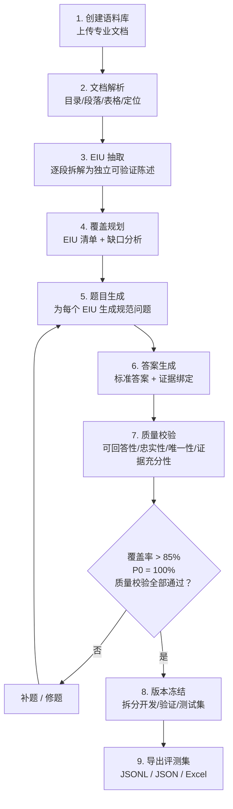

# EvalForge 智能评测集平台 Demo 技术方案

> 适用范围：基于《智能评测集平台业务需求书 V1.2》，优先支持本地单机 Demo、三人协作开发与后续迭代。
>
> **核心定位：本平台是一个评测集自动化生成系统，不是一个 RAG 问答系统。**

---

## 1. 平台本质

### 1.1 一句话定义

输入一组文档 → 自动拆解为可评测信息单元（EIU） → 为每个 EIU 生成带标准答案和证据绑定的评测题 → 通过覆盖率和质量门禁验证评测集质量 → 导出标准化评测数据集。

### 1.2 不是什么

| 不是 | 是 |
|---|---|
| 不是 RAG 知识库问答系统 | 是评测集生成工厂 |
| 不是"按段落批量出题" | 是"EIU 驱动的精准出题" |
| 不是检索召回演示 | 是评测数据集的自动化生产线 |
| 不是简单的上传→搜索→展示 | 是上传→EIU 抽取→出题→质量门禁→导出 |

检索（向量、关键词、关系索引）在本平台中是一个**辅助工具**，用于帮 EIU 抽取器和题目生成器高效定位原文证据和发现跨段关系，**不是平台最终产出物**。

---

## 2. 端到端业务主链路



**Demo 阶段目标：走通 1 → 2 → 3 → 5 → 6 → 7 → 8 → 9 的全链路，产出可用的评测数据集。**

---

## 3. Demo 范围与成功标准

### 3.1 必做范围

| 序号 | 模块 | Demo 做什么 |
|---|---|---|
| 1 | 语料库与文档接入 | 上传 PDF/DOCX/TXT/MD，存入本地存储，记录版本和哈希 |
| 2 | 文档解析 | 提取目录、段落、表格行，保留页码/章节定位 |
| 3 | EIU 抽取 | LLM 驱动抽取（Demo 单通道），按 FR-SEM-004 规则拆分 |
| 4 | 覆盖清单 | 生成 EIU 清单，标记 P0/P1/P2 权重，识别未覆盖缺口 |
| 5 | 单段问题生成 | LLM 为每个 EIU 生成 1 道规范问题 |
| 6 | 标准答案 + 证据绑定 | LLM 生成标准答案 + 答案要点 + 原文证据定位 |
| 7 | 基础质量校验 | 可回答性、忠实性、唯一性、证据充分性 4 项检查 |
| 8 | 覆盖率计算 | 按 FR-COVER-002 公式计算加权 EIU 覆盖率 |
| 9 | 版本冻结与导出 | 生成评测集版本号，导出 JSON/JSONL/Excel |

### 3.2 暂缓范围

| 暂缓项 | 说明 |
|---|---|
| 跨段/跨文档题目生成 | Demo 只做单段题 |
| 改写与反例生成 | Demo 只做规范问题 |
| 评测治理审核 Skill | Demo 只做基础 4 项质量检查，不做 S0 强制规则 |
| EIU 双通道校验 | Demo 单通道 LLM 抽取 |
| 调用待测系统评测 | 这是平台的下游使用场景，不在 Demo 范围 |
| 失败归因与优化 | Demo 不做 |
| 增量更新与回流 | Demo 不做 |
| 智能问答交互 | Demo 仅占位 |

### 3.3 Demo 成功标准

- [ ] 上传 2 份以上真实/脱敏文档，完成入库和解析
- [ ] LLM 抽取 EIU 清单，EIU 数量合理、类型分布覆盖定义/规则/数值/日期等
- [ ] 为每个可出题 EIU 生成 1 道规范问题 + 标准答案 + 原文证据定位
- [ ] 每道题的答案要点可追溯到原文的具体段落/页码
- [ ] 计算并展示加权 EIU 覆盖率，P0 覆盖率独立展示
- [ ] 质量校验自动运行，未通过项有明确原因
- [ ] 导出完整评测数据集（JSON/JSONL），下游可直接消费

---

## 4. 总体技术架构

### 4.1 技术栈

| 层 | 选型 | 说明 |
|---|---|---|
| 后端框架 | Python + FastAPI | 异步 HTTP API，Swagger 自动文档 |
| 数据库 | SQLite（Demo） | 存储语料库、文档、Block、EIU、题目、答案、运行记录 |
| 对象存储 | 本地文件系统（Demo） | 存储原始文档和导出产物 |
| 向量索引 | FAISS（辅助） | 为 EIU 抽取和跨段发现提供语义检索（Demo 阶段非核心） |
| Embedding | BGE-small-zh-v1.5（本地） | 段落向量化（辅助检索） |
| LLM | 可配置（OpenAI 兼容 API） | EIU 抽取 + 题目生成 + 答案生成 + 质量校验 |
| 前端 | 管理台风格静态页面（Demo） | 上传页、EIU 清单页、题目预览页、覆盖报告页 |

### 4.2 架构分层

```
┌──────────────────────────────────────────────┐
│                 接入层                        │
│  管理台页面（上传 / EIU / 题目 / 覆盖报告）    │
│  HTTP API（FastAPI）                          │
├──────────────────────────────────────────────┤
│                 业务层                        │
│  ┌──────────┐ ┌──────────┐ ┌──────────────┐ │
│  │ 文档管理  │ │ EIU 抽取  │ │ 题目答案生成  │ │
│  │ 解析/切块 │ │ 覆盖规划  │ │ 证据绑定     │ │
│  └──────────┘ └──────────┘ └──────────────┘ │
│  ┌──────────┐ ┌──────────┐ ┌──────────────┐ │
│  │ 质量校验  │ │ 版本管理  │ │ 导出         │ │
│  └──────────┘ └──────────┘ └──────────────┘ │
├──────────────────────────────────────────────┤
│                 数据层                        │
│  SQLite（元数据） + 本地文件（原始文档）         │
│  + FAISS（向量索引，辅助检索）                  │
├──────────────────────────────────────────────┤
│                 模型层                        │
│  BGE Embedding（本地） + LLM API（可配置）      │
└──────────────────────────────────────────────┘
```

### 4.3 核心数据流

```
原始文档（PDF/DOCX/TXT）
    │
    ▼
[1. 文档解析]
    │  结构化 Block（段落/表格行 + 章节路径 + 页码）
    │  存储：原始文件 → 本地磁盘，Block 记录 → SQLite
    │  向量化（辅助）：BGE → FAISS
    ├──→ Block 列表
    │
    ▼
[2. EIU 抽取]  ← LLM 驱动
    │  逐 Block 抽取可评测信息单元
    │  每个 EIU：陈述 / 类型 / 优先级 / 证据范围 / 权重
    │  对账：每个实质 Block 必须有 EIU 或排除记录
    ├──→ EIU 清单
    │
    ▼
[3. 覆盖规划]
    │  按章节 / 类型 / 优先级分组统计
    │  生成覆盖清单，标记缺口
    │
    ▼
[4. 题目生成]  ← LLM 驱动
    │  为每个可出题 EIU 生成 1 道规范问题
    │  题型匹配 EIU 类型
    ├──→ 题目列表
    │
    ▼
[5. 答案生成]  ← LLM 驱动
    │  标准答案 + 必须命中要点 + 可接受答案
    │  每个要点绑定原文证据定位
    ├──→ 完整 Case（题目 + 答案 + 证据）
    │
    ▼
[6. 质量校验]  ← LLM 驱动
    │  可回答性 / 忠实性 / 唯一性 / 证据充分性
    ├──→ 校验结果
    │
    ▼
[7. 覆盖计算]  ← 代码计算
    │  加权 EIU 覆盖率 = Σ(w_i × c_i) / Σ(w_i)
    │
    ▼
[8. 导出]
    │  版本冻结 + JSON / JSONL / Excel
    └──→ 评测数据集
```

---

## 5. 模块详细设计

### 5.1 文档接入与解析模块

**职责：** 接收上传文档 → 解析结构 → 生成 Block → 保存定位信息。

**输入：** PDF、DOCX、TXT、Markdown

**处理流程：**
1. 接收文件，计算 SHA256 哈希，检查重复
2. 原始文件存入本地存储（`storage/raw/{hash}_{filename}`）
3. 根据文件类型选择解析器：
   - TXT/MD：直接按段落切分
   - PDF：`PyMuPDF` 提取文本 + 页码
   - DOCX：`python-docx` 提取段落 + 表格
4. 每个段落/表格行生成一个 Block，记录：`section_path`、`page_no`、`block_type`、`block_text`
5. Block 写入 SQLite，同时可选生成 BGE 向量写入 FAISS

**Demo 简化：** 先做 TXT/MD 的段落切分 + PDF 的 `PyMuPDF` 基础提取。复杂表格、扫描件 OCR 降级处理。

### 5.2 EIU 抽取模块（平台核心）

**职责：** 从 Block 中抽取 EIU。这是整个平台最核心、最关键的一步。

**输入：** 一个语料库的 Block 列表（带章节上下文和页码）

**输出：** EIU 结构化记录列表

**抽取策略（Demo 版）：**

```
对每个 Block：
  1. 组装上下文：章节路径 + 相邻 Block 文本 + 文档元信息
  2. 调用 LLM，Prompt 要求：
     a. 判断该 Block 是否包含实质内容
     b. 按 FR-SEM-004 的 8 条规则拆分为 1-N 个 EIU
     c. 每个 EIU 标注：完整陈述 / 类型 / 优先级 / 限定信息
  3. 输出结构化 JSON 数组
```

**EIU 类型定义：**

| EIU 类型 | 典型识别特征 | 题目类型 |
|---|---|---|
| definition | 术语定义、概念说明 | 定义题 |
| rule | 带完整条件的规则结论 | 条件与适用范围题 |
| threshold | 门槛、阈值、数值限额 | 阈值和数值题 |
| date | 生效、失效或过渡日期 | 时效题 |
| formula | 计算公式或变量口径 | 公式与计算题 |
| process | 流程步骤或材料要求 | 流程顺序题 |
| exception | 例外、豁免、放宽条款 | 例外与边界题 |
| prohibition | 禁止事项、不得…… | 是否可回答题 |

**优先级定义：**
- **P0（权重 5）**：监管禁止事项、关键阈值、例外条款、安全边界、强制合规
- **P1（权重 3）**：核心定义、主流程、核心指标和公式
- **P2（权重 1）**：一般说明和补充事实

**Prompt 设计要点：**
- Few-shot 示例（至少包含授信政策和财报场景各 2 条）
- 明确要求输出 JSON 数组
- 强调 FR-SEM-004 规则：限制定语不可脱离、例外单列、定义与公式分列
- 要求为每个 EIU 绑定原文 Block ID

### 5.3 覆盖规划模块

**职责：** 基于 EIU 清单，统计覆盖率，识别缺口。

**处理流程：**
1. 汇总所有 EIU，按章节、EIU 类型、优先级分组
2. 统计各维度的 EIU 数量和权重
3. 记录排除项及其排除原因
4. 检查实质 Block 对账率
5. 生成覆盖清单

**覆盖计算公式（FR-COVER-002）：**

```
WeightedCoverage = Σ(w_i × c_i) / Σ(w_i)

其中：
  w_i: P0=5, P1=3, P2=1
  c_i: 1（该 EIU 已有通过质量校验的规范问题），0（未覆盖）
```

### 5.4 题目生成模块

**职责：** 为每个可出题 EIU 生成规范问题。

**输入：** 一个 EIU（含陈述、类型、优先级、原文证据范围）

**输出：** 1 道规范问题 + 题型标记 + 难度标记

**Prompt 设计要点：**
- 给定 EIU 的完整陈述和原文上下文
- 要求生成一道符合题型的问题
- 问题必须能仅凭给定材料回答（不自带前提、不泄露答案）
- Demo 每 EIU 只生成 1 道规范问题

### 5.5 答案生成与证据绑定模块

**职责：** 为每道题生成标准答案，并绑定原文证据。

**输入：** 题目 + 关联的 EIU + 原文 Block 文本 + Block 定位信息

**输出：**

```json
{
  "case_id": "case_000001",
  "intent_id": "intent_profit_margin_001",
  "question": "该公司本年度的净利润率是多少？",
  "question_type": "calculation",
  "difficulty": "L1",
  "gold_answer": "10%",
  "must_have_points": [
    "净利润为100万元",
    "营业收入为1000万元",
    "净利润率 = 净利润 / 营业收入"
  ],
  "acceptable_answers": ["10.0%", "百分之十"],
  "evidence": [
    {
      "document_id": 1,
      "document_name": "某企业财报.pdf",
      "section_path": "合并利润表",
      "page_no": 35,
      "block_id": 120,
      "original_text": "净利润 1,000,000 元"
    }
  ],
  "eiu_ids": ["eiu_018"],
  "content_priority": "P1",
  "review_status": "quality_verified"
}
```

**关键约束：**
- 每个答案要点必须绑定至少一条原文证据
- 证据必须包含原文定位（章节路径、页码、原文片段）
- 答案不得超出原文支持范围
- 原文确实没有答案时，标记为"不可回答题"

### 5.6 质量校验模块

**职责：** 自动检查每道题的生成质量。

**Demo 做 4 项检查：**

| 检查项 | 规则 | 实现方式 |
|---|---|---|
| 可回答性 | 材料中是否包含完整答案所需的所有信息 | LLM 判定 |
| 忠实性 | 答案的每个要点是否被原文证据支持 | LLM 逐要点对原文 |
| 唯一性 | 是否存在多个同样合理的答案未被收录 | LLM 判定 |
| 证据充分性 | 证据是否完整覆盖答案的所有要点 | LLM 辅助判定 |

**校验结果：** 每道题标注 `quality_verified` / `needs_revision` + 失败原因。

### 5.7 导出模块

**职责：** 将评测数据集导出为标准格式。

**导出格式：** JSONL（主流评测框架）、JSON（含版本元信息）、Excel/CSV（人工审阅）

---

## 6. 数据设计

### 6.1 核心实体关系

```
corpus（语料库）
  └── document（原始文档）
       └── block（结构化段落/表格行）
            └── eiu（可评测信息单元）
                 └── case（评测样本 = 题目 + 答案 + 证据）

coverage_report（覆盖报告）
quality_check_result（质量校验结果）
dataset_version（评测集版本）
```

### 6.2 表字段定义

#### corpus
| 字段 | 类型 | 说明 |
|---|---|---|
| corpus_id | INT PK | |
| name | VARCHAR | |
| description | TEXT | |
| domain | VARCHAR | 业务领域 |
| created_at | DATETIME | |
| version | VARCHAR | |

#### document
| 字段 | 类型 | 说明 |
|---|---|---|
| document_id | INT PK | |
| corpus_id | INT FK | |
| file_name | VARCHAR | |
| file_type | VARCHAR | |
| file_size | BIGINT | |
| content_hash | VARCHAR(128) | SHA256 去重 |
| storage_path | VARCHAR | |
| parse_status | VARCHAR | |
| uploaded_at | DATETIME | |

#### block
| 字段 | 类型 | 说明 |
|---|---|---|
| block_id | INT PK | |
| document_id | INT FK | |
| parent_block_id | INT | 父 Block（标题层级） |
| section_path | VARCHAR | |
| page_no | INT | |
| block_type | VARCHAR | paragraph / table_row / title / list_item |
| block_text | TEXT | 原文 |
| embedding_vector | BLOB/JSON | BGE 向量（辅助检索，可选） |

#### eiu
| 字段 | 类型 | 说明 |
|---|---|---|
| eiu_id | INT PK | |
| corpus_id | INT FK | |
| block_id | INT FK | 源 Block |
| statement | TEXT | 完整陈述 |
| eiu_type | VARCHAR | definition / rule / threshold / date / formula / process / exception / prohibition |
| content_priority | VARCHAR | P0 / P1 / P2 |
| weight | INT | 5 / 3 / 1 |
| constraints_json | JSON | {主体, 条件, 范围, 期间, 币种, 单位} |
| evidence_blocks | JSON | [block_id, ...] |
| is_questionable | BOOL | |
| exclusion_reason | VARCHAR | |
| extraction_model | VARCHAR | |
| extraction_confidence | FLOAT | |
| review_status | VARCHAR | candidate / quality_verified / blocked |
| created_at | DATETIME | |

#### eval_case
| 字段 | 类型 | 说明 |
|---|---|---|
| case_id | INT PK | |
| intent_id | VARCHAR | 意图 ID |
| eiu_id | INT FK | |
| question | TEXT | |
| question_type | VARCHAR | |
| difficulty | VARCHAR | L1 / L2 / L3 |
| scope_type | VARCHAR | single_segment |
| gold_answer | TEXT | |
| must_have_points | JSON | |
| acceptable_answers | JSON | |
| evidence | JSON | [{document_id, section_path, page_no, block_id, original_text}] |
| content_priority | VARCHAR | P0 / P1 / P2 |
| review_status | VARCHAR | candidate / quality_verified / blocked / needs_revision |
| created_at | DATETIME | |

#### quality_check_result
| 字段 | 类型 | 说明 |
|---|---|---|
| check_id | INT PK | |
| case_id | INT FK | |
| check_type | VARCHAR | answerability / faithfulness / uniqueness / evidence_sufficiency |
| passed | BOOL | |
| reason | TEXT | |
| checked_at | DATETIME | |

#### coverage_report
| 字段 | 类型 | 说明 |
|---|---|---|
| report_id | INT PK | |
| corpus_id | INT FK | |
| total_eiu_count | INT | |
| covered_eiu_count | INT | |
| excluded_eiu_count | INT | |
| weighted_coverage_pct | FLOAT | |
| p0_coverage_pct | FLOAT | |
| p1_coverage_pct | FLOAT | |
| p2_coverage_pct | FLOAT | |
| block_reconciliation_pct | FLOAT | |
| report_json | JSON | |
| created_at | DATETIME | |

#### dataset_version
| 字段 | 类型 | 说明 |
|---|---|---|
| version_id | INT PK | |
| corpus_id | INT FK | |
| version_number | VARCHAR | |
| status | VARCHAR | draft / frozen / published |
| case_count | INT | |
| coverage_report_id | INT FK | |
| split_config | JSON | |
| created_at | DATETIME | |
| frozen_at | DATETIME | |

#### requirement_doc（业务需求书→测试功能点）
| 字段 | 类型 | 说明 |
|---|---|---|
| requirement_doc_id | INT PK | |
| corpus_id | INT FK | |
| file_name | VARCHAR | |
| file_type | VARCHAR | |
| requirement_version | VARCHAR | |
| business_domain | VARCHAR | |
| parse_status | VARCHAR | |
| uploaded_at | DATETIME | |

#### test_function_point
| 字段 | 类型 | 说明 |
|---|---|---|
| tfp_id | INT PK | |
| requirement_doc_id | INT FK | |
| section_path | VARCHAR | |
| requirement_id | VARCHAR | 原始需求编号 |
| statement | TEXT | 功能点陈述 |
| eiu_type | VARCHAR | functional_rule / business_rule / data_rule / interface_rule / nfr |
| content_priority | VARCHAR | P0 / P1 / P2 |
| weight | INT | |
| evidence_range | JSON | |
| is_questionable | BOOL | |
| exclusion_reason | VARCHAR | |
| extraction_confidence | FLOAT | |
| review_status | VARCHAR | |
| created_at | DATETIME | |

---

## 7. API 设计

### 7.1 语料库

| 方法 | 路径 | 说明 |
|---|---|---|
| POST | `/api/corpus` | 创建语料库 |
| GET | `/api/corpus` | 语料库列表 |
| GET | `/api/corpus/{corpus_id}` | 语料库详情 |

### 7.2 文档

| 方法 | 路径 | 说明 |
|---|---|---|
| POST | `/api/documents/upload` | 上传文档 |
| GET | `/api/documents` | 文档列表 |
| GET | `/api/documents/{document_id}` | 文档详情 |
| GET | `/api/documents/{document_id}/blocks` | Block 列表 |

### 7.3 EIU

| 方法 | 路径 | 说明 |
|---|---|---|
| POST | `/api/corpus/{corpus_id}/eiu/extract` | 触发 EIU 抽取 |
| GET | `/api/corpus/{corpus_id}/eiu` | EIU 清单（支持过滤） |
| GET | `/api/corpus/{corpus_id}/eiu/coverage` | 覆盖率报告 |
| GET | `/api/corpus/{corpus_id}/eiu/gaps` | 未覆盖 EIU 清单 |

### 7.4 题目与答案

| 方法 | 路径 | 说明 |
|---|---|---|
| POST | `/api/corpus/{corpus_id}/cases/generate` | 生成题目和答案 |
| GET | `/api/corpus/{corpus_id}/cases` | 评测样本列表 |
| GET | `/api/cases/{case_id}` | 样本详情（含证据定位） |
| PUT | `/api/cases/{case_id}` | 手动编辑样本 |

### 7.5 质量校验

| 方法 | 路径 | 说明 |
|---|---|---|
| POST | `/api/corpus/{corpus_id}/quality-check` | 触发全量质量校验 |
| GET | `/api/corpus/{corpus_id}/quality-check/results` | 校验结果汇总 |

### 7.6 导出

| 方法 | 路径 | 说明 |
|---|---|---|
| POST | `/api/corpus/{corpus_id}/freeze` | 冻结当前版本 |
| GET | `/api/corpus/{corpus_id}/versions` | 版本列表 |
| GET | `/api/versions/{version_id}/export?format=jsonl` | 导出评测集 |

### 7.7 业务需求书→测试功能点

| 方法 | 路径 | 说明 |
|---|---|---|
| POST | `/api/requirements/upload` | 上传需求书 |
| POST | `/api/requirements/{id}/extract` | 提取测试功能点 |
| GET | `/api/requirements/{id}/test-function-points` | 查看测试功能点 |
| GET | `/api/requirements/{id}/export` | 导出 |

### 7.8 Chat 占位（Demo 延后）

| 方法 | 路径 | 说明 |
|---|---|---|
| POST | `/api/chat/sessions` | 创建会话 |
| POST | `/api/chat/sessions/{id}/messages` | 发送消息 |

---

## 8. Demo 核心技术实现

### 8.1 LLM 调用封装

```python
class LLMClient:
    """可配置的 LLM 客户端，支持 OpenAI 兼容 API + 本地 Ollama。"""

    def __init__(self, api_base: str, api_key: str, model: str):
        self.api_base = api_base
        self.model = model

    def chat(self, system_prompt: str, user_prompt: str,
             response_format: str = "json_object") -> str:
        """调用 LLM，返回文本响应。"""

    def extract_eiu_from_block(self, block_text: str, context: dict) -> list[dict]:
        """从单个 Block 抽取 EIU。"""

    def generate_question(self, eiu: dict) -> dict:
        """为单个 EIU 生成问题。"""

    def generate_answer(self, question: str, evidence_blocks: list) -> dict:
        """基于证据生成标准答案。"""

    def quality_check(self, case: dict) -> list[dict]:
        """执行 4 项质量检查。"""
```

### 8.2 Prompt 模板（版本化管理，存放于 `prompts/` 目录）

**EIU 抽取 Prompt 核心要点：**
- 系统角色：授信政策和财务报告分析专家
- 任务：将给定段落拆分为可评测信息单元（EIU）
- 规则：独立真值 / 限定语不可脱离 / 例外单列 / 定义公式分列 / 无实质内容不计数
- 输出：JSON 数组，每个 EIU 含 statement / eiu_type / priority / constraints / is_questionable / exclusion_reason

**题目生成 Prompt 核心要点：**
- 系统角色：评测集编制专家
- 任务：根据 EIU 生成符合题型的高质量评测题
- 约束：仅凭材料可答 / 不泄露答案 / 正式书面表达

**答案生成 Prompt 核心要点：**
- 系统角色：评测标准答案编制专家
- 任务：基于原文证据生成标准答案
- 约束：仅基于原文 / 列出所有要点 / 逐要点绑定证据 / 原文无答案则拒答

**质量校验 Prompt 核心要点：**
- 系统角色：评测集质量审核专家
- 任务：逐项检查可回答性 / 忠实性 / 唯一性 / 证据充分性
- 输出：每项 passed + reason

### 8.3 主工作流

```python
class EvalForgePipeline:
    """评测集生成主工作流。"""

    def run(self, corpus_id: int):
        blocks = self.parse_documents(corpus_id)      # 1. 文档解析
        eius = self.extract_eius(blocks)               # 2. EIU 抽取
        coverage = self.build_coverage(eius)           # 3. 覆盖清单
        cases = self.generate_cases(eius)              # 4. 题目生成
        cases = self.generate_answers(cases)           # 5. 答案 + 证据
        cases = self.quality_check(cases)              # 6. 质量校验
        coverage = self.calculate_coverage(eius, cases)# 7. 覆盖率
        version = self.freeze_and_export(cases)        # 8. 导出
        return version
```

### 8.4 项目目录结构

```
evalforge-demo/
├── backend/
│   ├── app/
│   │   ├── api/               # FastAPI 路由
│   │   │   ├── corpus.py
│   │   │   ├── documents.py
│   │   │   ├── eiu.py
│   │   │   ├── cases.py
│   │   │   ├── quality.py
│   │   │   ├── export.py
│   │   │   ├── requirements.py
│   │   │   └── chat.py
│   │   ├── core/
│   │   │   ├── config.py
│   │   │   └── llm_client.py  # LLM 客户端
│   │   ├── models/            # SQLAlchemy 模型
│   │   ├── schemas/           # Pydantic Schema
│   │   ├── services/
│   │   │   ├── parser.py      # 文档解析
│   │   │   ├── eiu_extractor.py    # EIU 抽取（LLM 驱动）
│   │   │   ├── case_generator.py   # 题目生成（LLM 驱动）
│   │   │   ├── quality_checker.py  # 质量校验（LLM 驱动）
│   │   │   ├── coverage.py    # 覆盖率计算
│   │   │   ├── pipeline.py    # 主工作流
│   │   │   ├── storage.py     # 文件存储
│   │   │   └── indexer.py     # FAISS 辅助索引
│   │   └── utils/
│   │       └── embedding.py   # BGE Embedding
│   ├── prompts/               # Prompt 模板（版本化）
│   │   ├── eiu_extraction.txt
│   │   ├── question_generation.txt
│   │   ├── answer_generation.txt
│   │   └── quality_check.txt
│   ├── tests/
│   ├── pyproject.toml
│   └── README.md
├── frontend/
│   └── src/
│       └── pages/
│           ├── dashboard/
│           ├── corpus/
│           ├── eiu/
│           ├── cases/
│           └── export/
├── docs/
│   ├── architecture.md
│   ├── api.md
│   ├── data-model.md
│   └── demo-guide.md
├── scripts/
│   ├── init_db.sql
│   ├── seed_demo_data.py
│   └── run_pipeline.py
├── deploy/
│   ├── docker-compose.yml
│   └── env.example
└── README.md
```

---

## 9. Demo 标注

### 9.1 LLM 生成结果的存储与人工修正

| 步骤 | 实现方式 | 存储 | 人工干预入口 |
|---|---|---|---|
| 文档解析 | 代码 | SQLite | 无需干预 |
| EIU 抽取 | LLM | SQLite | 可查看/编辑/删除 EIU |
| 题目生成 | LLM | SQLite | 可修改题目文本/题型 |
| 答案生成 | LLM | SQLite | 可修改答案/要点/证据 |
| 质量校验 | LLM | SQLite | 可确认/驳回校验结果 |
| 覆盖率计算 | 代码 | SQLite | 自动计算 |

### 9.2 LLM 风险控制

- **Prompt 版本化**：`prompts/` 目录下的模板文件随代码一起 Git 管理
- **结果持久化**：LLM 每一步生成结果都写入 SQLite，支持回滚和重新生成
- **确定性计算**：覆盖率、Block 对账等使用纯代码，不依赖 LLM
- **模型配置化**：LLM 的 api_base / model 通过环境变量配置

### 9.3 Demo 不做的

- ❌ 上传文档 → 自动就出完美评测集（仍需人工校验和修正）
- ❌ 自动调用待测系统跑分
- ❌ 跨段/跨文档题目
- ❌ EIU 双通道校验
- ❌ 治理审核 Skill（S0 强制规则）
- ❌ 多轮迭代优化和回流

---

## 10. 三人分工

| 人员 | 负责模块 | 具体内容 |
|---|---|---|
| **A：后端与数据** | 数据层 + API + EIU | SQLite 表设计、文件存储、EIU 抽取器、覆盖规划、API 框架 |
| **B：题目与答案** | 题目/答案生成 + 质量 | 文档解析、LLM Prompt 设计、题目生成器、答案生成器、证据绑定、4 项质量校验 |
| **C：前端与联调** | 前端 + 导出 + 联调 | EIU 清单页、题目预览页、覆盖报告页、导出管理页、Chat 占位、联调 |

---

## 11. 3 天交付计划

### Day 1：环境搭好 + 文档解析 + EIU 抽取跑通
- 建仓 + 配置文件 + 依赖安装
- SQLite 表创建 + 文档上传 + 解析（PDF/TXT/MD）
- LLM 客户端 + EIU 抽取 Prompt 联调
- EIU 抽取 + 存储 + 查询 API

### Day 2：题目 + 答案 + 质量校验跑通
- 题目生成 Prompt + 答案生成 Prompt 联调
- 题目生成器 + 答案生成器 + 证据绑定实现
- 4 项质量校验实现
- 全部 API 联调

### Day 3：前端 + 导出 + 演示
- 覆盖率计算 + 版本冻结 + JSONL 导出
- 前端关键页面（EIU 清单、题目预览、覆盖报告）
- 准备 2 份演示文档 + 跑完整 Demo 流程
- README + 演示脚本

---

## 12. 交付物

- 技术设计文档（本文档）
- 可运行本地 Demo（完整后端代码）
- SQLite 数据库（自动初始化）
- Prompt 模板（`prompts/` 目录，版本化）
- Swagger API 文档
- 演示脚本 + 示例数据（2 份文档 + 生成的评测集）
- 前端关键页面（EIU 清单 / 题目预览 / 覆盖报告）
