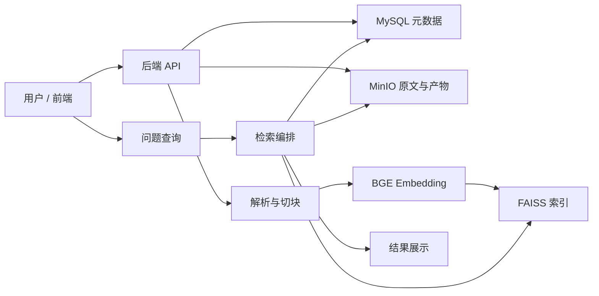

# 智能评测集平台本地 Demo 技术方案

> 适用范围：基于《智能评测集平台业务需求书》与当前落地讨论，优先支持本地单机 Demo、GitHub 协作开发与后续迭代。
>
> 目标：在几周内做出可演示、可验证、可协作的最小闭环，而不是一次性实现完整平台。

## 1. 项目目标

本阶段要完成的不是完整生产平台，而是一个能跑通业务主链路的本地 Demo：

1. 用户上传专业文档。
2. 系统将文档保存到对象存储，并抽取结构化内容。
3. 文档切块后生成向量，构建检索索引。
4. 用户输入问题后，系统检索相关证据块并返回结果。
5. 展示原文证据、来源位置和基础运行记录。
6. 将结果、任务状态和元数据持久化，便于后续协作开发。

本阶段重点验证四件事：

- 文档能否稳定入库和回溯；
- 检索链路能否跑通；
- 证据是否能定位到原文；
- 前后端是否能形成可演示闭环。

## 2. 需求收口建议

业务需求书中包含完整的平台能力，但本次 Demo 需要主动收口。建议本阶段只保留以下范围：

### 2.1 必做范围

- 文档上传与存储
- 文档解析与切块
- 向量化与 FAISS 检索
- 问题输入与证据召回
- 结果展示与运行记录
- 基础任务状态管理
- GitHub 协作开发流程

### 2.2 暂缓范围

以下能力先不做或只做占位：

- 完整 EIU 自动治理闭环
- 多轮回流工作台
- 增量更新与旧版本淘汰
- 复杂目录树浏览与多种导出格式
- 多模态 OCR 复杂图表识别
- 完整审批流、多用户权限体系
- 生产级分布式扩展与高可用

### 2.3 Demo 成功标准

Demo 至少满足：

- 可上传文档并保存到 MinIO
- 可写入 MySQL 元数据
- 可完成文档向量化并建立 FAISS 索引
- 可基于问题召回证据块
- 可在前端查看文档、查询结果和证据来源
- 可重复运行并保留历史记录

## 3. 总体技术方案

### 3.1 技术栈

- 后端：Python
- 数据库：MySQL
- 向量检索：FAISS
- 对象存储：MinIO
- Embedding：BGE 系列模型
- 前端：管理台风格页面，强调清晰展示与高效操作
- 协作方式：GitHub + 分支开发 + Pull Request

### 3.2 架构分层

系统建议按四层拆分：

1. 接入层：前端页面、HTTP API
2. 业务层：文档管理、任务流、检索编排、结果聚合
3. 数据层：MySQL、MinIO、FAISS
4. 模型层：BGE embedding、可选的轻量生成/问答模型

### 3.3 核心设计原则

- 原始文档和派生数据分离保存。
- 原文证据必须可回溯到文件和段落位置。
- 检索主键统一管理，避免向量索引与业务数据脱节。
- 任务异步化，避免前端长时间阻塞。
- Demo 阶段优先稳定性和可解释性，不追求复杂智能。

## 4. 本地 Demo 架构



### 4.1 数据流

1. 文件上传后，原始文档存入 MinIO。
2. 后端在 MySQL 中创建文档记录和任务记录。
3. 解析模块读取原始文件，生成章节、段落、表格行等结构化块。
4. 每个块生成 embedding，并写入 FAISS。
5. 查询时，系统先做问题 embedding，再用 FAISS 召回候选块。
6. 后端将候选块、原文片段和来源信息整理后返回前端。
7. 前端展示答案、证据和运行状态。

## 5. 模块设计

### 5.1 文档接入模块

职责：

- 接收 PDF、DOCX、TXT、Markdown、CSV、XLSX 等文件
- 将文件写入 MinIO
- 记录文件哈希、大小、类型、上传人、版本号
- 生成文档任务并触发后续解析

关键点：

- 同名不同内容文件不能覆盖。
- 使用内容哈希做去重判断。
- 任务状态要可追踪。

### 5.2 文档解析模块

职责：

- 提取章节、段落、表格、列表、页码或工作表信息
- 生成基础切块
- 保留每个块的原文位置和来源文档信息
- 为后续 embedding 提供干净输入

Demo 期建议：

- 先以段落和表格行为主
- 复杂版面、扫描件 OCR 先降级处理
- 解析失败要有明确错误原因

### 5.3 向量化与索引模块

职责：

- 调用 BGE 模型生成 embedding
- 将块向量写入 FAISS
- 保存块 ID 与向量 ID 的映射关系到 MySQL
- 支持新增文档后的增量建索引

建议：

- 先使用单机 FAISS
- 索引文件持久化到本地磁盘或 MinIO
- MySQL 保存索引版本、模型版本和构建时间

### 5.4 检索与问答模块

职责：

- 接收用户问题
- 生成问题向量
- 调用 FAISS 召回 Top-K 候选块
- 按分数和元数据做基础重排
- 返回证据片段、来源位置和检索结果

Demo 阶段可以先不强依赖复杂生成模型，优先做“检索 + 证据展示”；如果后续需要，可以在检索结果上接一个轻量问答总结层。

### 5.5 运行与任务模块

职责：

- 跟踪上传、解析、索引、查询等任务状态
- 记录开始时间、结束时间、耗时、错误信息
- 支持前端轮询或刷新任务结果

### 5.6 前端展示模块

页面建议最少包含：

- 文档上传页
- 文档列表页
- 文档详情页
- 问题检索页
- 检索结果页
- 任务与日志页

前端风格建议走“管理台 + 高信息密度”路线，页面不需要炫技，但要清晰、稳定、可读。

## 6. 数据设计

### 6.1 MySQL 核心表建议

#### corpus
- corpus_id
- name
- description
- domain
- created_by
- created_at
- version

#### document
- document_id
- corpus_id
- file_name
- file_type
- file_size
- content_hash
- minio_path
- upload_user
- upload_time
- document_version
- parse_status
- parse_error

#### document_block
- block_id
- document_id
- parent_block_id
- section_path
- page_no
- block_type
- block_text
- start_offset
- end_offset
- metadata_json
- embedding_id

#### task_job
- job_id
- job_type
- target_id
- status
- progress
- error_message
- started_at
- finished_at

#### retrieval_query
- query_id
- question
- corpus_id
- top_k
- status
- created_at

#### retrieval_result
- result_id
- query_id
- block_id
- score
- rank
- source_excerpt
- created_at

#### run_log
- log_id
- job_id
- level
- message
- created_at

### 6.2 MinIO 对象建议

- raw/：原始文件
- parsed/：解析结果 JSON
- chunks/：切块结果
- exports/：导出文件
- logs/：附件日志或调试产物

### 6.3 FAISS 索引建议

- 一个语料库一个索引，或先做单全局索引再按 corpus_id 过滤
- 索引版本与模型版本绑定
- 每次重新建索引都生成新的索引版本号
- 向量主键必须和 MySQL 中的 block_id 可追溯对应

## 7. 关键流程

### 7.1 上传流程

1. 用户选择文件并上传。
2. 后端接收文件，计算哈希。
3. 文件写入 MinIO。
4. MySQL 生成 document 记录。
5. 创建解析任务并返回任务 ID。

### 7.2 解析与索引流程

1. 后端读取原始文件。
2. 解析模块生成结构化块。
3. 块写入 MySQL。
4. 调用 BGE 生成 embedding。
5. 写入 FAISS 并保存映射。
6. 更新任务状态为成功或失败。

### 7.3 查询流程

1. 用户输入问题。
2. 问题向量化。
3. 从 FAISS 召回 Top-K 块。
4. 从 MySQL 和 MinIO 取回原文与来源信息。
5. 前端展示结果列表和证据定位。

## 8. 接口设计建议

### 8.1 文档接口

- POST /api/documents/upload
- GET /api/documents
- GET /api/documents/{document_id}
- GET /api/documents/{document_id}/blocks

### 8.2 任务接口

- GET /api/jobs/{job_id}
- GET /api/jobs
- POST /api/jobs/{job_id}/retry

### 8.3 检索接口

- POST /api/retrieval/query
- GET /api/retrieval/query/{query_id}
- GET /api/retrieval/query/{query_id}/results

### 8.4 导出接口

- POST /api/exports/dataset
- GET /api/exports/{export_id}

## 9. GitHub 协作方案

### 9.1 仓库组织

建议建立一个单仓库，后端、前端、配置和文档统一管理，便于小团队协作。

推荐目录：

- backend/
- frontend/
- docs/
- scripts/
- deploy/

### 9.2 分支策略

- main：稳定可演示版本
- dev：集成分支
- feature/backend-core：后端主干
- feature/retrieval：解析与检索
- feature/frontend-ui：前端页面

### 9.3 协作方式

- 先开 Issue，再开发。
- 每个功能一条 PR。
- PR 必须附运行截图或验证说明。
- AI coding 只负责局部实现，关键接口和数据结构必须人工复核。
- 仓库统一上传到 GitHub，所有代码、文档和配置都以仓库为唯一协作入口。
- 三人分别维护各自负责模块，避免多人同时修改同一文件，必要时先在 Issue 中确认接口再动手。
- 每天至少同步一次分支状态，避免本地和远端长期分叉。

## 10. 三人分工建议

### 10.1 A：后端与数据层

负责：

- MySQL 表结构设计
- MinIO 集成
- 文件上传与任务管理
- API 基础框架
- 日志与运行记录
- 仓库主分支集成和后端公共接口维护

### 10.2 B：解析、向量化与检索

负责：

- 文档解析
- 切块策略
- BGE embedding 集成
- FAISS 索引与召回
- 检索结果组装
- 解析策略、切块策略和检索效果维护

### 10.3 C：前端与联调

负责：

- 页面原型与交互设计
- 上传页、列表页、结果页
- 接口联调
- Demo 演示脚本
- 前端仓库内容、页面展示和演示材料维护

如果需要更快出效果，C 也可以兼做项目推进和验收统筹。

### 10.4 维护边界

- A 负责后端与数据链路的稳定性。
- B 负责解析、索引和召回效果。
- C 负责前端体验、联调和演示呈现。
- 需要跨模块修改时，先在 Issue 里确认责任人，再合并到对应分支。

## 11. 3 天交付计划

### 第 1 天：仓库与主链路搭建

- 建立 GitHub 仓库并完成目录初始化
- 接通 MinIO、MySQL、FAISS 的本地运行环境
- 完成文档上传、文件入库和任务表记录
- 确定前后端接口格式与分支规范

### 第 2 天：解析、向量化与检索

- 完成文档解析与基础切块
- 接入 BGE embedding
- 构建 FAISS 索引和检索接口
- 打通问题查询到证据召回的后端链路

### 第 3 天：前端展示与联调发布

- 完成上传页、列表页、检索页、结果页
- 联调前后端并修复阻塞问题
- 准备演示数据和 README
- 将可运行版本推送到 GitHub 主分支或发布分支

### 交付标准

- 仓库可拉起
- 本地可运行
- 文档可上传、可检索、可展示证据
- 三人按模块持续维护，后续只在各自负责范围内迭代

## 12. 风险与对策

### 12.1 文档解析不稳定

对策：先支持常见格式，复杂扫描件先降级处理并显式报错。

### 12.2 检索效果不稳定

对策：先用标准切块 + BGE + FAISS 的最小方案，后续再加重排和更细粒度规则。

### 12.3 需求范围失控

对策：严格区分 Demo、MVP 和正式平台，不在本阶段加入回流、权限、多模型对比等复杂能力。

### 12.4 协作冲突

对策：统一数据结构、统一接口约定、统一 PR 规范。

## 13. 交付物

本阶段最终应交付：

- 技术设计文档
- 可运行本地 Demo
- 数据库表结构
- 接口文档
- GitHub 仓库与分支规范
- 演示脚本
- 基础部署说明

## 14. 结论

对于三人小团队，最稳妥的路线是先做本地单机 Demo，把文档上传、解析、向量化、检索和前端展示跑通，再逐步扩展到 EIU、审核和自动评测闭环。当前技术选型是合理的，关键不在于堆功能，而在于先把数据链路、证据链路和协作链路做稳定。

## 15. 仓库目录结构与初始化文件

下面是建议的 GitHub 仓库骨架，适合三人并行维护，也便于后续从本地 Demo 平滑扩展。

```text
evalforge-demo/
├── backend/
│   ├── app/
│   │   ├── api/
│   │   ├── core/
│   │   ├── models/
│   │   ├── services/
│   │   ├── workers/
│   │   └── utils/
│   ├── tests/
│   ├── pyproject.toml
│   └── README.md
├── frontend/
│   ├── src/
│   │   ├── pages/
│   │   ├── components/
│   │   ├── services/
│   │   └── styles/
│   ├── public/
│   ├── package.json
│   └── README.md
├── docs/
│   ├── architecture.md
│   ├── api.md
│   ├── data-model.md
│   └── demo-guide.md
├── scripts/
│   ├── init_mysql.sql
│   ├── init_minio.sh
│   ├── build_faiss_index.py
│   └── seed_demo_data.py
├── deploy/
│   ├── docker-compose.yml
│   └── env.example
├── .github/
│   └── workflows/
│       └── ci.yml
├── .gitignore
├── .editorconfig
├── LICENSE
├── README.md
└── technical_design_demo.md
```

### 15.1 初始化文件清单

- `README.md`：仓库总说明，写清项目目标、启动方式、协作规则和演示路径。
- `technical_design_demo.md`：技术方案正文，作为长期参考文档。
- `backend/pyproject.toml`：后端 Python 依赖与构建配置。
- `frontend/package.json`：前端依赖、脚本与构建配置。
- `deploy/docker-compose.yml`：本地一键启动 MySQL、MinIO、后端和前端的编排文件。
- `deploy/env.example`：环境变量示例。
- `scripts/init_mysql.sql`：初始化表结构。
- `scripts/seed_demo_data.py`：注入演示数据。
- `scripts/build_faiss_index.py`：本地构建 FAISS 索引。
- `docs/architecture.md`：系统架构图与模块职责。
- `docs/api.md`：接口定义。
- `docs/data-model.md`：核心数据表和对象关系。
- `docs/demo-guide.md`：本地启动和演示步骤。
- `.github/workflows/ci.yml`：最基本的持续集成检查。
- `.gitignore`：忽略虚拟环境、构建产物和本地配置。

### 15.2 推荐创建顺序

1. 先建 GitHub 仓库和 `README.md`。
2. 再补 `backend/`、`frontend/`、`docs/`、`scripts/`、`deploy/` 目录。
3. 先提交 `docker-compose.yml`、`env.example`、`init_mysql.sql`、`README.md`。
4. 后端、前端、脚本按各自模块逐步补齐。

### 15.3 三人维护建议

- A 主要维护 `backend/`、`deploy/` 和数据库脚本。
- B 主要维护 `scripts/`、解析索引逻辑和数据初始化。
- C 主要维护 `frontend/` 和 `docs/` 中的演示说明。
- 任何跨目录改动，都先在 Issue 里明确责任人，再合并到对应分支。
